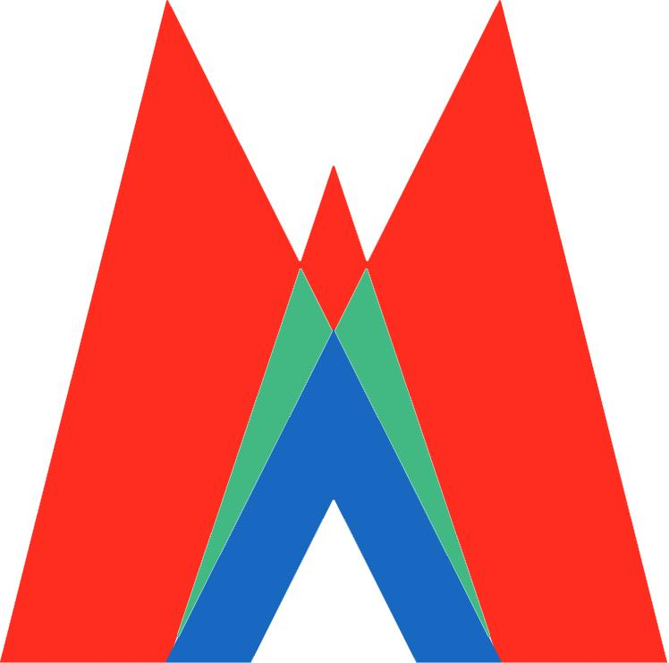

## Requirements

All major requirements of Modularity listed as following: 

| Version    | PHP (*)   | Laravel | Node | Vuetify |
| ---        | ---       | ---     | ---  | ---     |
| 0          | 8.1 - 8.2 | 10      | >=18 | 3       |
| 1          | 8.1 - 8.2 | 10      | >=18 | 3       |
| 2 (future) | 8.2 - 8.3 | 11      | >=18 | 3       |

## About Modularity

Modularity is a Laravel and Vuetify powered, developer toolkit that aims to improve developer experience on conducting full stack development process. On Laravel side, the modularity manages your large scale projects using modules, where a module similar to a single Laravel project, having some views, controllers or models. With the abilities of Vuetify.js, the modularity presents various of dynamic, configurable UI components to auto-construct a CRM for your project.

<!-- Modularity takes the pain out of development by easing common tasks used in many web projects, such as:

- [Simple, fast routing engine](https://unusualify.com/modularity/docs/routing).
- [Powerful dependency injection container](https://unusualify.com/modularity/docs/container).
- Multiple back-ends for [session](https://unusualify.com/modularity/docs/session) and [cache](https://unusualify.com/modularity/docs/cache) storage.
- Expressive, intuitive [database ORM](https://unusualify.com/modularity/docs/eloquent).
- Database agnostic [schema migrations](https://unusualify.com/modularity/docs/migrations).
- [Robust background job processing](https://unusualify.com/modularity/docs/queues).
- [Real-time event broadcasting](https://unusualify.com/modularity/docs/broadcasting). -->

## Learning Modularity

Modularity has the most extensive and thorough [documentation](https://unusualify.com/modularity).

## Contributing

Thank you for considering contributing to the Modularity toolkit! The contribution guide can be found in the [Modularity documentation](https://unusualify.com/modularity/contributions).

<!-- ## Code of Conduct

In order to ensure that the Laravel community is welcoming to all, please review and abide by the [Code of Conduct](https://laravel.com/docs/contributions#code-of-conduct). -->

<!-- ## Security Vulnerabilities

If you discover a security vulnerability within Laravel, please send an e-mail to Taylor Otwell via [taylor@laravel.com](mailto:taylor@laravel.com). All security vulnerabilities will be promptly addressed. -->

## License

The Modularty toolkit is open-sourced software licensed under the [MIT license](https://opensource.org/licenses/MIT).
