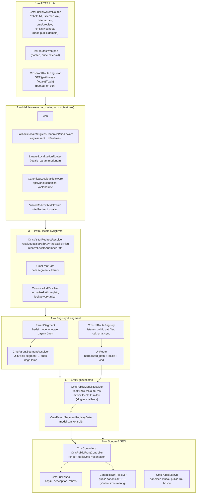

# CMS public stack — uçtan uca ve dokunma haritası

Bu belge, ön yüz CMS URL’lerinin **parent segment + UrlRoute + çözümleyici + SEO/canonical** zincirinde nasıl işlendiğini özetler. Projede yapılan güncel noktaları toparlayıp, “ne nereye dokunuyor” sorusuna dönüş için tek kaynak olarak kullanın.

---

## Kısa özet

1. **ParentSegment**  
   Hangi modelin hangi dilde hangi URL önekiyle (ör. `pages`, boş önek ana sayfa) yayında olduğu **kayıt defteri**. Catch-all ve `CmsParentSegmentResolver` burayı okur.

2. **UrlRoute + CmsUrlRouteRegistry**  
   Yayınlanan her public sayfa satırı: `locale` + `normalized_path` + `urlable` + `kind`. **Reklam/SEO URL’lerinin tek kaynağı**; admin’de slug/path değişince registry eşitlenir (observer + job’lar).

3. **Public çözümleme (CmsPublicModelResolver)**  
   İstek path’ini ve locale’i **visitor path** katmanından alır, `UrlRoute` satırını bulur, modele bağlar.

4. **Redirect katmanı**  
   `Redirect` entity + `CmsVisitorRedirectResolver`: sayfa değilse ve kural varsa HTTP yönlendirme. Ziyaretçi redirect’leri `VisitorRedirectMiddleware` ile stack’te.

5. **SEO + canonical**  
   View’a giden başlık/açıklama/canonical: `CmsPublicSeo` + `CanonicalUrlResolver(Interface)`.  
   Config: `cms_routing.canonical_host`, `redirect_to_canonical`, `hide_default_locale_segment`, slugless ayarları.

6. **HTTP error pages (ErrorPage module)**  
   URL stack’inin dışında: `HttpException` 403/404/500 → published `ErrorPage` by `error_code` → LayoutBuilder body wrap.  
   Ayrıntı: [`ERROR_PAGE.md`](./ERROR_PAGE.md). ParentSegment / UrlRoute **yok**.

---

## Katmanlı akış (diyagram)

Aşağıdaki sıra, tipik bir **GET public sayfa** isteğinde genel olarak geçilen katmanları gösterir (middleware sırası config’e göre ince ayarlanır).

**Okuma ipuçları**

- **Kayıt sırası:** built-in sistem rotaları (`CmsPublicSystemRouteRegistrar`, provider `boot`) → host `routes/web.php` (framework `booted`) → CMS catch-all (`CmsRouteServiceProvider` `booted`). Host’taki spesifik path’ler catch-all’ı sırayla yener.
- **Yeni built-in sistem endpoint:** `CmsPublicSystemRoutes::definitions()` satırı ekle (domain + catch-all exclude otomatik). Host `/test` için Modularous’a dokunma; `routes/web.php` yeter (gerekirse `public_front_catch_all_exclude_path_prefixes`).
- Catch-all `{path}` **reserved prefix’leri** eşleştirmez (`CmsPublicSystemRoutes::reservedPathPrefixes()` → `CmsFrontRouteRegistrar::catchAllPathParameterPattern`).
- Kısa host/app rehberi: VitePress [CMS → Public routing](/guide/cms/public-routing).
- **Implicit (prefix’siz) URL**’ler yalnızca **slugless fallback locale** (veya slugless kapalıysa CMS default locale) için `UrlRoute` satırıyla eşleşir; başka dilde tek satır varsa prefix’siz istek 404 olur (`CmsPublicModelResolver::resolveUrlRouteWhenLocaleImplicit`).

---

## Ne nereye dokunuyor — hızlı tablo

| Konu | Ana sınıf / dosya | Config anahtarları (örnek) |
|------|-------------------|----------------------------|
| Public catch-all kaydı | `modules/Cms/Routing/CmsFrontRouteRegistrar.php` (booted) | `cms_routing.*`, `cms_features.enabled` |
| Built-in sistem rotaları | `CmsPublicSystemRoutes` + `CmsPublicSystemRouteRegistrar` | `cms_seo.robots`, `cms_sitemap`, `signed_preview`, `cms_stylesheets` |
| Locale’li route grubu | `CmsFrontRouteLocalizationBinding` | `public_front_route_group_mode`, `localization_driver` |
| Domain’e bağlama | `CmsFrontRouteRegistrar::resolvePublicFrontRouteDomain` | `public_front_route_domain`, `public_front_routes_allow_any_host` |
| Ziyaretçi yönlendirme | `CmsVisitorRedirectResolver`, `VisitorRedirectMiddleware` | `visitor_redirects_enabled` |
| UrlRoute satırları | `Entities/UrlRoute.php`, `CmsUrlRouteRegistry` | `tables.cms_url_routes` |
| Parent segment | `Entities/ParentSegment.php`, `CmsParentSegmentResolver` | `cms_parent_segments.*` |
| Sayfa çözümleme | `CmsPublicModelResolver` | `fallback_locale_optional_path_segment`, `public_pages_enabled` |
| Canonical / path norm | `CanonicalUrlResolver`, `CanonicalUrlResolverInterface` | `canonical_host`, `redirect_to_canonical`, `hide_default_locale_segment` |
| Blade SEO | `CmsPublicSeo` | — (çeviri alanları + resolver) |
| Panel permalink host | `CmsPublicSiteUrl` | `public_front_route_domain`, `canonical_host` |
| İmzalı önizleme | `CmsSignedPublicPreviewController`, `CmsSignedPreviewUrlGenerator` | `signed_preview.*` |

---

## Bu çalışmada eklenen / sıkılaştırılan davranışlar (geri dönüş notu)

1. **Catch-all vs imzalı önizleme** — `{path}` artık `cms/preview/...` (ve isteğe bağlı ek prefix’ler) ile başlamıyor; paylaşılabilir önizleme linki doğru controller’a gider.
2. **Domain politikası** — Public catch-all varsayılan olarak `APP_URL` host’una sıkılaştırılabilir; tam tersi için `public_front_routes_allow_any_host` veya eski `bind_public_routes_to_app_url_host` ters-mantık uyumu.
3. **locale_param + slugless** — Hem `{locale}/{path}` hem prefix’siz `{path}` kayıtları (slugless açıkken).
4. **Implicit locale = yalnızca fallback/default** — Prefix’siz URL yalnızca belirlenen implicit locale’nin `UrlRoute` satırıyla eşleşir; yalnızca TR satırı varken `/tr/...` kullanılmalı.
5. **Public system route catalog** — `CmsPublicSystemRoutes` + `CmsPublicSystemRouteRegistrar`; catch-all `booted` ile host `web.php` sonrasında; reserved prefix’ler katalogdan.

---

## İlgili birleşik config dosyası

Çoğu anahtar: `config/merges/cms_routing.php` (uygulamada `modularous.cms_routing.*`).

---

*Son güncelleme: CMS public stack; VitePress rehber: [CMS](src/pages/guide/cms/overview.md).*
