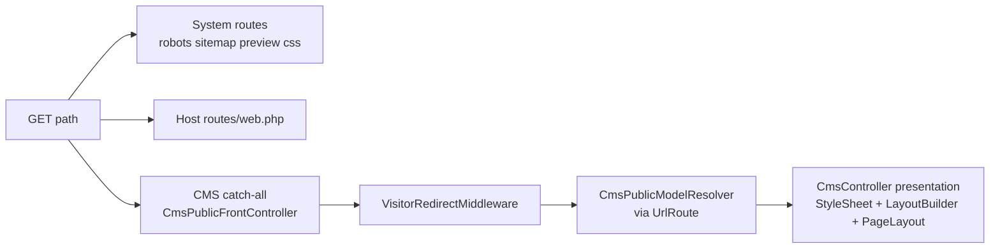
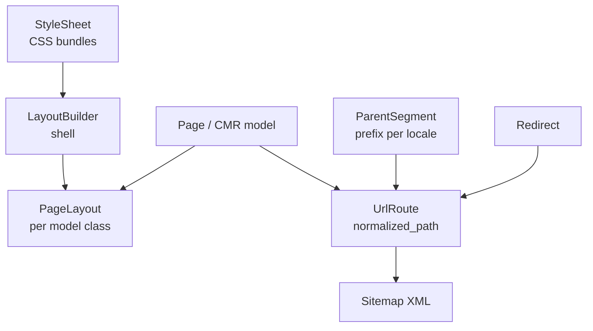

# CMS Overview

The **Cms** module turns Modularous into a multi-locale public site: content models get URL prefixes, published paths live in a registry, and presentation is composed from stylesheets → layout shells → per-model page layouts.

Enable the stack with `modularous.cms_features.enabled` (and related toggles under [Configuration](./configuration)).

## Building blocks

| Piece | Role |
|-------|------|
| **ParentSegment** | Per model class + locale: shared public URL prefix |
| **UrlRoute** | Flat registry of published paths (`page_public`, `redirect_source`) |
| **StyleSheet** | Compiled CSS (+ framework links) |
| **LayoutBuilder** | Reusable HTML document shell; attaches StyleSheet(s) |
| **PageLayout** | Locale-agnostic presentation binding **per model class**; points at a LayoutBuilder |
| **Page / CMR models** | Content (`IsCmr` = parent segment + page layout) |
| **Redirect** | From/to path rules; synced into UrlRoute |
| **Sitemap** | Built from `page_public` UrlRoute rows; served at `/sitemap.xml` |

## How a public page request flows

1. Built-in **system routes** and host **`routes/web.php`** run before the catch-all — see [Public routing](./public-routing).
2. Remaining paths hit the CMS catch-all; redirects may fire before page resolve — [Redirects](./redirects).
3. **UrlRoute** + ParentSegment gate resolve the model — [Parent segments & URL routes](./parent-segments-and-url-routes).
4. Presentation layers (bottom → top): [Stylesheets](./stylesheets) → [Layout builders](./layout-builders) → [Page layouts](./page-layouts).
   - Themes: `cms.layout_builder.{slug}.*` under `resources/views/cms/layout_builder/{slug}/` (`blade_view_name` often **NULL**).
   - Per-route bodies: `{module}::{route}.page_layout.*` under `modules/{Module}/Resources/views/{route}/page_layout/` (`blade_view_name` often **NULL**).

## Relationship map

- **Presentation stack:** StyleSheet → LayoutBuilder → PageLayout (read the guides in that order).
- **URLs** live on ParentSegment + UrlRoute (and Redirect) — separate from Blade shells.
- Do not put Blade shells on ParentSegment — that split is intentional.

## Guide index

| Topic | Page |
|-------|------|
| Catch-all, host `web.php`, excludes | [Public routing](./public-routing) |
| Prefixes + UrlRoute registry | [Parent segments & URL routes](./parent-segments-and-url-routes) |
| CSS compile + public `.css` route | [Stylesheets](./stylesheets) |
| Document shell + Blade sources | [Layout builders](./layout-builders) |
| Per-model presentation binding | [Page layouts](./page-layouts) |
| Visitor redirects | [Redirects](./redirects) |
| HTTP 403 / 404 / 500 CMS records | [Error pages](./error-pages) |
| `/sitemap.xml` + robots | [Sitemap & SEO](./sitemap-and-seo) |
| `modularous.cms_*` keys | [Configuration](./configuration) |
