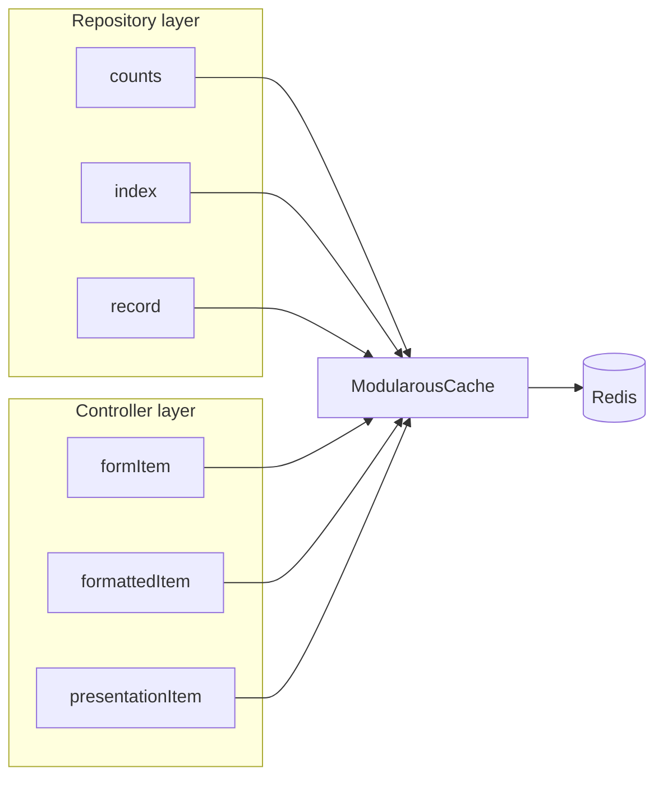

# Cache Types

Each cache type maps to a specific admin panel payload. Enable only the types that are expensive for your module — disabling `index` while keeping `formattedItem` is a common pattern for large tables.

## Summary

| Type | What is stored | Producer | Default TTL |
|------|----------------|----------|-------------|
| `counts` | Filter badge integers (all, published, draft, trash, custom scopes) | `CountBuilders` via `cacheableCount()` | 300s |
| `index` | Paginated Eloquent collection or `LengthAwarePaginator` | `QueryBuilder::getPaginator` → `getCached` | 600s |
| `record` | Single Eloquent model (with optional eager loads / scopes) | `CacheableTrait::getByIdCached` | 1800s |
| `formattedItem` | Table row array (columns, relations, thumbnails) | `TableItem::getFormattedIndexItem` | 1800s |
| `formItem` | Edit form payload (schema fields + appends) | `FormPageUtility::getFormItem` | 1800s |
| `presentationItem` | Public CMS inner body HTML (locale + record scoped) | `CmsPublicPresentationItemCache` | 900s |
| `response:json` | Controller-level formatted JSON (reserved) | Config TTL only | 300s |
| `response:index` | Controller-level index page response (reserved) | Config TTL only | 300s |

## `counts`

**Purpose:** Sidebar and toolbar filter badges (`All`, `Published`, `Draft`, `Trash`, custom scope counts).

**Key specifier:** `count:{slug}` — e.g. `count:all`, `count:published`.

**Producer:**

```php
// CountBuilders.php
return $this->cacheableCount('all', function () {
    return $this->filter($query, $this->countScope)->count();
});
```

**Invalidation:** On model create, update, delete, restore — counts change when totals or status fields change.

**User-aware:** Yes, when repository uses `CreatorTrait` / `AssignmentTrait` and `user_aware` is true.

## `index`

**Purpose:** Raw paginated list from the repository before controller formatting.

**Key specifier:** `index` + hash of `with`, `scopes`, `orders`, `perPage`, `appends`, `exceptIds`, and optional `_user`.

**Producer:** `QueryBuilder::getPaginator()` delegates to `getCached()` when `shouldUseCache('index')` is true.

**Relation tags:** When `trackCacheRelations` is enabled (default), `rememberIndexWithRelations` extracts foreign keys from each row and calls `putWithRelations`.

**When to disable:** Large tables where caching full paginated pages is wasteful — prefer `formattedItem` per visible row instead (see b2press-app `PressRelease` config).

## `record`

**Purpose:** Single model by id, including optional `with`, `withCount`, `lazy`, and `scopes`.

**Key:** Generated via `ModularousCache::generateCacheKey` with params `['id' => $id, …]`.

**Producer:** `CacheableTrait::getByIdCached()`.

**Relation tags:** `rememberRecordWithRelations` tags cache entries with the record's foreign keys.

**Note:** `CacheKeyGenerators` throws for direct `record` type in `rememberCache` — repository path uses `generateCacheKey` directly instead.

## `formattedItem`

**Purpose:** Fully transformed table row for the admin DataTable — column values, relationship links, thumbnails, presenters.

**Key specifier:** `formattedItem:{id}` + locale in params hash.

**Producer:**

```php
// TableItem.php
return $this->rememberCache(
    callback: fn () => $this->formatIndexItem($item, $translated, $this->formSchema),
    type: 'formattedItem',
    data: ['id' => $item->id, 'locale' => app()->getLocale()]
);
```

**Invalidation:** Per-record on update/delete; skipped for newly created models in `invalidateForModel`.

**Warmup:** `WarmupCache::warmupControllerItem` calls `getFormattedIndexItem` when type is enabled.

## `formItem`

**Purpose:** Serialized form state for the edit/create panel — title, timestamps, and all hydrated form fields.

**Key specifier:** `formItem:{id}` + locale.

**Producer:** `CacheableResponse::getCacheableFormItem()` wraps `FormPageUtility::getFormItem`.

**Locale sensitivity:** Locale is included in the key because translated form schemas differ per language.

**Warmup:** `getFormItem($id, withoutDefaultScopes: true)` during warm commands.

## `presentationItem`

**Purpose:** Cached inner HTML for public CMS `page_layout/body` fragments (locale + record scoped). The layout shell (navigation, head assets) still renders on each request.

**Key specifier:** `presentationItem:{id}` + locale in params hash (optional `full` flag when no page-layout shell).

**Producer:**

```php
// CmsController::renderPublicCmsPresentation()
CmsPublicPresentationItemCache::rememberInnerHtml($moduleName, $moduleRouteName, $item, $viewName, $innerData);
```

**Opt-in:** Disabled by default (`presentationItem => false` in package defaults). Enable per module route in app `config/modularous.php`.

**Module/route resolution:** Universal `CmsPublicFrontController` resolves StudlyCase module + route from the model via `CmsPublicFrontViewName::presentationItemCacheContextForModel()` — not from the controller's `Cms/Public` identity.

**Invalidation:** Same path as `formattedItem` / `formItem` — `CacheObserver` → `invalidateForModel()` → route tag flush or `invalidatePresentationItemCache()`.

**Warmup:** `WarmupCache::warmupPresentationItem($moduleName, $routeName, $item)` (host app or artisan warm hooks).

## `response:json` and `response:index`

Defined in `config/merges/cache.php` TTL block for **controller-level fully transformed HTTP responses**. TTL defaults to 300 seconds via `MODULAROUS_RESOURCE_CACHE_TTL_RESPONSE`.

These types are part of the configuration contract for future or app-specific controller response caching. Repository and table/form types above are the primary production paths today.

## Type Toggle Example

From b2press-app — optimize for payment-heavy press release admin:

```php
'PressRelease' => [
    'enabled' => true,
    'routes' => [
        'PressRelease' => [
            'types' => [
                'counts' => true,
                'index' => false,        // skip full page cache
                'record' => false,
                'formattedItem' => true, // cache per-row formatting
                'formItem' => true,
            ],
        ],
    ],
],
```

## Cache Flow by Type



## See Also

- [Configuration](./configuration) — TTL and `types` toggles
- [Invalidation](./invalidation) — which types flush on each event
- [Warmup](./warmup) — pre-populating `counts`, `formItem`, `formattedItem`
