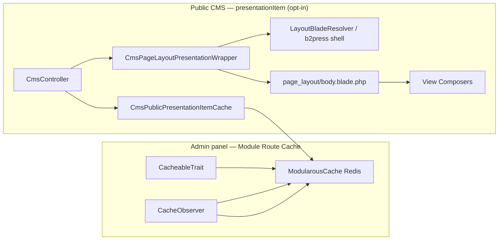

# CMS Public Pages vs Module Route Cache

Public CMS pages can opt into the **`presentationItem`** cache type — the same Modularous Redis layer as admin `formItem` / `formattedItem`, but scoped to public HTML at `CmsController::renderPublicCmsPresentation()`.

## Two Layers



| Concern | Admin cache types | Public `presentationItem` |
|---------|-------------------|---------------------------|
| **Target** | Admin CRUD (JSON, tables, forms) | Inner body HTML (or full view without layout shell) |
| **Entry point** | Repository / `PanelController` | `CmsController::renderPublicCmsPresentation()` |
| **Config** | `modularous.cache.modules.{Module}.routes.{Route}.types.presentationItem` | Same — **disabled by default** |
| **Invalidation** | `CacheObserver` + graph | Same route tag flush on model save |
| **Shell / nav** | N/A | Still fresh each request (layout wrapper, `B2PressNavigation`) |

**Key message:** Enable `presentationItem` per pilot route in app config. Admin-only types (`formattedItem`, `formItem`) do not accelerate public pages.

## How `presentationItem` Works

1. **`CmsController`** resolves the published model and builds `$innerData` (`item`, SEO fields).
2. **Module/route keying:** For universal `CmsPublicFrontController`, StudlyCase module + route come from the model (`CmsPublicFrontViewName::presentationItemCacheContextForModel`), not `Cms/Public`.
3. **Cache miss:** Renders `page_layout/body` (view composers run — `$item` and derived vars unchanged).
4. **Cache hit:** Injects `previewBodyHtml` into the wrapper; shell (head, nav, footer) still renders.
5. **Preview URLs:** Signed preview bypasses cache (`forcePreviewRobotsNoIndex`).

### Key pattern

```
{prefix}:{Module}:{Route}:presentationItem:{id}:{locale_hash}
```

Optional `full` param hash when caching a standalone view (no page-layout shell).

### Opt-in example (b2press-cms)

```php
'PrimaryPage' => [
    'routes' => [
        'Home' => [
            'types' => [
                'presentationItem' => true,
            ],
        ],
    ],
],
```

## Complementary b2press Optimizations

These remain separate from `presentationItem`:

| Layer | Purpose |
|-------|---------|
| `CmsPresentationCache` | Optional DTO cache for shared presentation builders (nav, country directory) |
| `B2PressCmsNavModels` | Batch-load nav models per request |
| View Composers | Supply `$heroSlider`, `$featureItems`, etc. to `body.blade.php` on cache miss |

Do **not** replace view composers with presentation classes inside blades — composers must run on cache miss so `$item`-based blades work as-is.

## Risks

| Risk | Mitigation |
|------|------------|
| Stale body after CMS edit | `CacheObserver` route tag flush; default TTL 900s |
| Preview serves cached HTML | Bypass on signed preview |
| Wrong module/route key on catch-all | Always resolve from model class, not controller `$moduleName` |
| Redis unavailable | Same graceful degradation as `ModularousCacheService` |

## See Also

- [Cache Types](./cache-types) — `presentationItem` spec
- [Per-Module Setup](./per-module-setup) — enable per route
- [Configuration](./configuration) — TTL hierarchy
