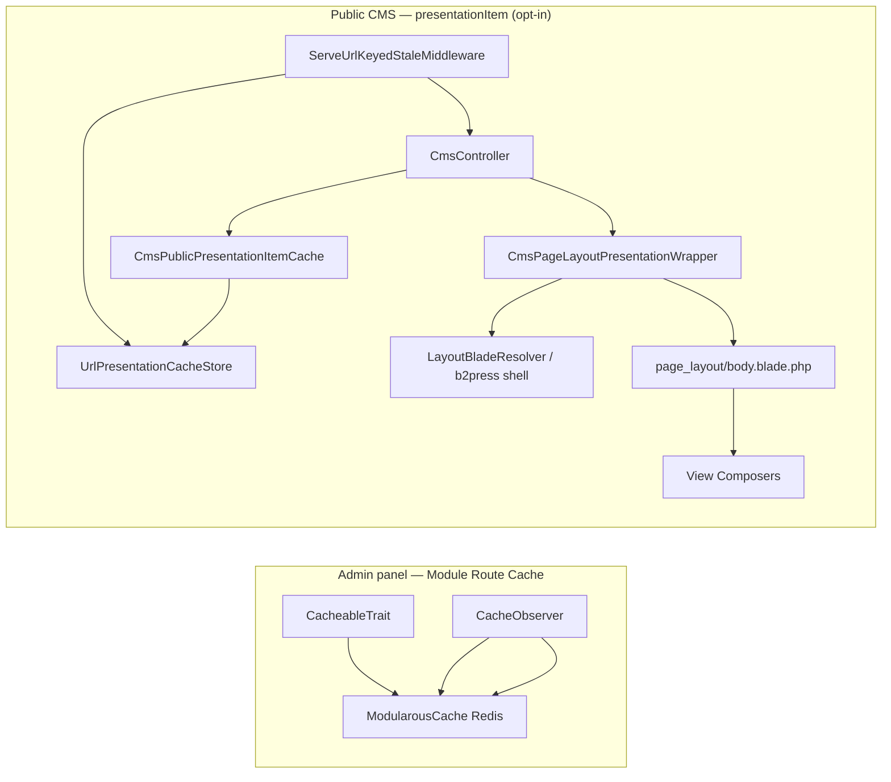

# CMS Public Pages vs Module Route Cache

Public CMS pages can opt into the **`presentationItem`** cache type — file-primary HTML keyed by locale + URL path, configured per route at `CmsController::renderPublicCmsPresentation()`. Admin types (`formItem`, `formattedItem`, etc.) stay on Redis.

For CMS routing, layouts, and stylesheets, see the [CMS guide](/guide/cms/overview).

See [URL Stale Resilience](./url-stale-resilience) for the disk-first middleware, path layout, and [multi-node extension point](./url-stale-resilience#multi-node-scaling).

## Two Layers



| Concern | Admin cache types | Public `presentationItem` |
|---------|-------------------|---------------------------|
| **Target** | Admin CRUD (JSON, tables, forms) | Inner body HTML (or full view without layout shell) |
| **Entry point** | Repository / `PanelController` | `CmsController::renderPublicCmsPresentation()` |
| **Config** | `modularous.cache.modules.{Module}.routes.{Route}.types.presentationItem` | Same — **disabled by default** |
| **Invalidation** | `CacheObserver` + graph | `UrlRoute` path forget + relation tags |
| **Storage** | Redis | URL-keyed filesystem (no Redis for public HTML) |
| **Shell / nav** | N/A | Still fresh each request (layout wrapper, `B2PressNavigation`) |

**Key message:** Enable `presentationItem` per pilot route in app config. Admin-only types (`formattedItem`, `formItem`) do not accelerate public pages.

## How `presentationItem` Works

1. **`CmsController`** resolves the published model and builds `$innerData` (`item`, SEO fields).
2. **Module/route keying:** For universal `CmsPublicFrontController`, StudlyCase module + route come from the model (`CmsPublicFrontViewName::presentationItemCacheContextForModel`), not `Cms/Public`.
3. **Cache miss:** Renders `page_layout/body` (view composers run — `$item` and derived vars unchanged).
4. **Cache hit:** Injects `previewBodyHtml` into the wrapper; shell (head, nav, footer) still renders.
5. **Preview URLs:** Signed preview bypasses cache (`forcePreviewRobotsNoIndex`).

### URL stale + SWR

When `modularous.cache.resilience.url_stale.enabled` is true (default):

1. `ServeUrlKeyedStaleMiddleware` tries the URL file **before** the controller.
2. On controller path, `resolvePresentationHtml()` reads/writes the same URL file.
3. Optional id-based `StaleFileCache` remains a transitional fallback when SWR is enabled.
4. Stale URL hit dispatches `WarmPresentationItemJob` (600s cooldown lock).
5. Response includes `X-Modularous-Cache: presentationItem=URL_HIT|URL_STALE|STALE|MISS|...`.

See [URL Stale Resilience](./url-stale-resilience) and [SWR](./swr).

### Key pattern

```
{prefix}:{Module}:{Route}:presentationItem:{id}:{locale_hash}
```

Optional `full` param hash when caching a standalone view (no page-layout shell).

### Opt-in example (b2press-cms)

```php
'PrimaryPage' => [
    'routes' => [
        'Home' => [
            'types' => [
                'presentationItem' => true,
            ],
        ],
    ],
],
```

## Complementary b2press Optimizations

These remain separate from `presentationItem`:

| Layer | Purpose |
|-------|---------|
| `CmsPresentationCache` | Optional DTO cache for shared presentation builders (nav, country directory) |
| `B2PressCmsNavModels` | Batch-load nav models per request |
| View Composers | Supply `$heroSlider`, `$featureItems`, etc. to `body.blade.php` on cache miss |

Do **not** replace view composers with presentation classes inside blades — composers must run on cache miss so `$item`-based blades work as-is.

## Risks

| Risk | Mitigation |
|------|------------|
| Stale body after CMS edit | `CacheObserver` route tag flush; default TTL 900s; SWR stale cleared via relation tags |
| Preview serves cached HTML | Bypass on signed preview |
| SWR serves outdated HTML after edit | Enable webhook `action=both` or rely on relation-tag invalidation |
| Wrong module/route key on catch-all | Always resolve from model class, not controller `$moduleName` |
| Redis unavailable | URL-keyed disk serve via middleware; admin cache degrades per `ModularousCacheService` |

## Staging Pilot (b2press-cms)

Recommended rollout order for `presentationItem` + SWR + webhook on staging:

1. Enable `presentationItem` for one low-risk route (e.g. `PrimaryPage::Home`).
2. Warm caches: `php artisan modularous:cache:warm PrimaryPage Home --presentationItems`.
3. Enable `MODULAROUS_RESOURCE_CACHE_SWR_ENABLED=true` and confirm `X-Modularous-Cache` shows `STALE` after fresh TTL expiry.
4. Enable webhook with a staging-only secret; trigger `action=both` after CMS edits.
5. Monitor `storage/logs/modularous-resource-cache.log` and Horizon `modularous-cache` queue.

## See Also

- [Cache Types](./cache-types) — `presentationItem` spec
- [Per-Module Setup](./per-module-setup) — enable per route
- [Configuration](./configuration) — TTL hierarchy
