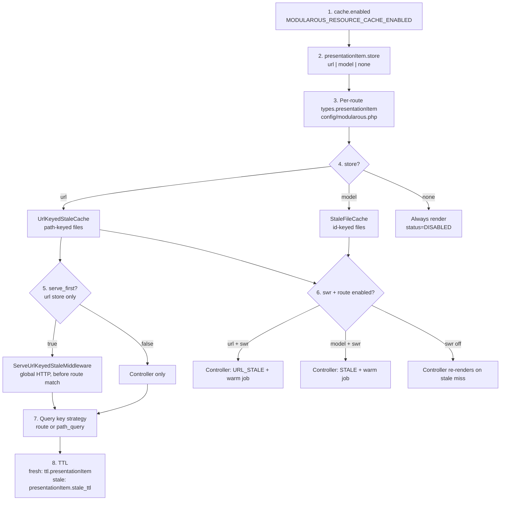

# Module Route Cache Configuration

Configuration is layered: package defaults in `config/merges/cache.php`, merged into `config('modularous.cache')`, with optional per-app overrides in `config/modularous.php` or `config/modularity.php`.

## Package Defaults (`config/merges/cache.php`)

```php
return [
    'enabled' => env('MODULAROUS_RESOURCE_CACHE_ENABLED', true),
    'all_modules' => env('MODULAROUS_RESOURCE_CACHE_ALL_MODULES', false),
    'environment_variable' => env('MODULAROUS_RESOURCE_CACHE_MODE', 'local'),
    'driver' => env('MODULAROUS_RESOURCE_CACHE_DRIVER', 'redis'),
    'prefix' => env('MODULAROUS_RESOURCE_CACHE_PREFIX', 'modularous'),
    'ttl' => [ /* counts, index, record, formItem, formattedItem, response:* */ ],
    'use_tags' => env('MODULAROUS_RESOURCE_CACHE_USE_TAGS', true),
    'user_aware' => env('MODULAROUS_RESOURCE_CACHE_USER_AWARE', true),
    'graph' => [
        'enabled' => env('MODULAROUS_RESOURCE_CACHE_GRAPH_ENABLED', true),
        'ttl' => (int) env('MODULAROUS_RESOURCE_CACHE_GRAPH_TTL', 86400),
    ],
    'modules' => [],
    'dependencies' => [],
];
```

## Global Environment Variables

| Key | Env variable | Default | Purpose |
|-----|--------------|---------|---------|
| `enabled` | `MODULAROUS_RESOURCE_CACHE_ENABLED` | `true` | Master switch; when false, all cache ops bypass |
| `all_modules` | `MODULAROUS_RESOURCE_CACHE_ALL_MODULES` | `false` | Default enable for every module when no per-module flag |
| `environment_variable` | `MODULAROUS_RESOURCE_CACHE_MODE` | `local` | Cache logging mode (`local`, `development`, `production`) |
| `driver` | `MODULAROUS_RESOURCE_CACHE_DRIVER` | `redis` | Laravel cache store name |
| `prefix` | `MODULAROUS_RESOURCE_CACHE_PREFIX` | `modularous` | Prepended to all keys and tags |
| `use_tags` | `MODULAROUS_RESOURCE_CACHE_USE_TAGS` | `true` | Tag-based invalidation (Redis / Memcached) |
| `user_aware` | `MODULAROUS_RESOURCE_CACHE_USER_AWARE` | `true` | Include auth user in count/index key hashes |

## TTL Environment Variables

| TTL key | Env variable | Default (seconds) |
|---------|--------------|-------------------|
| `counts` | `MODULAROUS_RESOURCE_CACHE_TTL_COUNTS` | 300 |
| `index` | `MODULAROUS_RESOURCE_CACHE_TTL_INDEX` | 600 |
| `record` | `MODULAROUS_RESOURCE_CACHE_TTL_RECORD` | 1800 |
| `formattedItem` | `MODULAROUS_RESOURCE_CACHE_TTL_FORMATTED_ITEM` | 1800 |
| `formItem` | `MODULAROUS_RESOURCE_CACHE_TTL_FORM_ITEM` | 1800 |
| `presentationItem` | `MODULAROUS_RESOURCE_CACHE_TTL_PRESENTATION_ITEM` | 900 |
| `response:json` | `MODULAROUS_RESOURCE_CACHE_TTL_RESPONSE` | 300 |
| `response:index` | `MODULAROUS_RESOURCE_CACHE_TTL_RESPONSE` | 300 |

## Graph Settings

| Key | Env variable | Default | Purpose |
|-----|--------------|---------|---------|
| `graph.enabled` | `MODULAROUS_RESOURCE_CACHE_GRAPH_ENABLED` | `true` | Auto-build relationship graph for cross-module invalidation |
| `graph.ttl` | `MODULAROUS_RESOURCE_CACHE_GRAPH_TTL` | `86400` | How long the built graph is cached |

Commands: `php artisan modularous:cache:graph show|rebuild|stats|analyze`

## Enable Resolution Order

`ModularousCacheService::isEnabled($module, $route, $type)` evaluates in order:

1. **Redis connected?** — if not, return `false`
2. **Global `enabled`** — if false, return `false`
3. **Module `modules.{Module}.enabled`** — falls back to `all_modules`
4. **Route `modules.{Module}.routes.{Route}.enabled`** — falls back to `all_modules`
5. **Type `modules.{Module}.routes.{Route}.types.{type}`** — per-type toggle

TTL resolution (`getTtl`) checks route-level TTL, then module-level TTL, then global `ttl.{type}`.

## Per-Module Override Structure

Module names use **StudlyCase**. Each module can define module-wide TTL and per-route overrides:

```php
'cache' => [
    'modules' => [
        'PressRelease' => [
            'enabled' => true,
            'ttl' => [
                'counts' => 900,
                'formattedItem' => 1800,
                'formItem' => 900,
            ],
            'routes' => [
                'PressRelease' => [
                    'enabled' => true,
                    'types' => [
                        'counts' => true,
                        'index' => false,
                        'record' => false,
                        'formattedItem' => true,
                        'formItem' => true,
                    ],
                ],
                'PressReleasePayment' => [
                    'enabled' => true,
                    'types' => [
                        'counts' => true,
                        'formattedItem' => true,
                        'formItem' => true,
                    ],
                ],
            ],
        ],
    ],
],
```

### Real-World Example: b2press-app

`b2press-app/config/modularity.php` (lines 726–865) enables `PressRelease` and `SystemPayment` with:

- **Counts + formattedItem + formItem** on — index and record off (large tables, row-level cache preferred)
- **`dependencies`** mapping `PressRelease`, `PressReleasePackage`, `Payment` updates to related route invalidation

Copy that pattern when a submodule displays data owned by another entity.

## Manual Dependencies

Use `cache.dependencies` when graph auto-discovery misses a path (vendor models, polymorphic edges, custom presenters):

```php
'dependencies' => [
    'Modules\Company\Entities\Company' => [
        [
            'moduleName' => 'PressRelease',
            'moduleRouteName' => 'PressReleasePayment',
            'types' => [
                'counts' => false,
                'index' => false,
                'record' => true,
                'formattedItem' => true,
                'formItem' => true,
            ],
            'targetRelationshipName' => 'pressReleasePayments',
        ],
    ],
],
```

Keys must be **full model class names**. Entries merge with graph-discovered dependents in `CacheObserver`.

## App Override Locations

| App | Typical file |
|-----|--------------|
| Standalone Modularous app | `config/modularous.php` → `'cache' => [ … ]` |
| b2press-app | `config/modularity.php` → `'cache' => [ … ]` |
| b2press-cms (admin pilot) | `config/modularous.php` — add `cache` block when enabling admin cache |

Laravel merges package `config/merges/cache.php` automatically; app keys override defaults.

## Observer Queue (async invalidation)

When `cache.observer.queue` is true and `QUEUE_CONNECTION` is not `sync`, `CacheObserver` dispatches `InvalidateModelCacheJob` and `InvalidateDependentCachesJob` instead of blocking the admin save request.

| Env variable | Config key | Default |
|--------------|------------|---------|
| `MODULAROUS_CACHE_OBSERVER_QUEUE` | `observer.queue` | `true` |
| `MODULAROUS_CACHE_QUEUE_CONNECTION` | `observer.queue_connection` | `null` (uses `queue.default`) |
| `MODULAROUS_CACHE_QUEUE_NAME` | `observer.queue_name` | `modularous-cache` |

Run a dedicated worker:

```bash
php artisan queue:work --queue=modularous-cache
```

Set `observer.queue=false` in `phpunit.xml` to keep tests synchronous.

## Manual purge and admin cache actions

Per route you can defer observer invalidation and expose superadmin purge/warm buttons:

```php
'PackageCountry' => [
    'manual_purge' => true,
    'admin_cache_actions' => true,
    'purge' => [
        'presentationItem' => true,  // observer skips this type
        'formItem' => false,       // observer still auto-invalidates
    ],
],
```

- `manual_purge: true` — observer skips auto invalidate/warm unless `purge.{type}` is explicitly `false`
- `admin_cache_actions: true` — form/index cache buttons (requires `ResourceCacheActionsTrait` on the repository)
- Endpoints: `POST .../cache/purge/{id}`, `POST .../cache/warm/{id}`, `POST .../cache/purge-all`, `POST .../cache/warm-all`

## Public presentationItem cache

Admin cache types (`record`, `index`, `formItem`, `formattedItem`, `counts`) stay on **Redis**. Public CMS HTML uses a separate **filesystem store** selected by `cache.presentationItem.store`. Redis is not used for public HTML reads or writes.

### Environment variables

| Env variable | Config key | Default | Legacy alias (when new var unset) |
|--------------|------------|---------|-----------------------------------|
| `MODULAROUS_PRESENTATION_CACHE_STORE` | `presentationItem.store` | `url` | `MODULAROUS_CACHE_URL_STALE_ENABLED=true` → `url`; `false` + `MODULAROUS_RESOURCE_CACHE_SWR_ENABLED=true` → `model`; `false` + SWR off → `none` |
| `MODULAROUS_PRESENTATION_CACHE_SWR` | `presentationItem.swr` | `false` | `MODULAROUS_RESOURCE_CACHE_SWR_ENABLED` |
| `MODULAROUS_PRESENTATION_CACHE_SERVE_FIRST` | `presentationItem.serve_first` | `true` | `MODULAROUS_CACHE_URL_STALE_SERVE_FIRST` |
| `MODULAROUS_PRESENTATION_CACHE_STALE_TTL` | `presentationItem.stale_ttl` | `604800` (7 days) | `MODULAROUS_CACHE_URL_STALE_TTL`, then `MODULAROUS_RESOURCE_CACHE_SWR_STALE_TTL` |
| `MODULAROUS_PRESENTATION_CACHE_URL_DRIVER` | `presentationItem.url.driver` | `file` | — |
| `MODULAROUS_CACHE_URL_STALE_PATH` | `presentationItem.url.base_path` | `storage/framework/cache/modularous-stale-by-url` | — |
| `MODULAROUS_RESOURCE_CACHE_SWR_STALE_PATH` | `presentationItem.model.stale_path` | `storage/framework/cache/modularous-stale` | — |
| `MODULAROUS_RESOURCE_CACHE_SWR_WARM_COOLDOWN` | `presentationItem.warm_dispatch_cooldown` | `600` | Also mirrored at `swr.warm_dispatch_cooldown` |
| `MODULAROUS_RESOURCE_CACHE_TTL_PRESENTATION_ITEM` | `ttl.presentationItem` | `900` (15 min) | — |

**Store values:** `url` (locale + path files, default) · `model` (id-keyed `StaleFileCache`) · `none` (always render, no public cache).

**URL driver values:** `file` (local disk) · `shared_file` (same implementation; mount EFS/NFS at `base_path` for multi-node).

Deprecated config aliases `cache.swr.*` and `cache.resilience.url_stale.*` still resolve for tests but new apps should use `presentationItem.*` only.

### Example `.env` (b2press-cms pilot)

```env
MODULAROUS_PRESENTATION_CACHE_STORE=url
MODULAROUS_PRESENTATION_CACHE_SWR=false
MODULAROUS_PRESENTATION_CACHE_SERVE_FIRST=true
MODULAROUS_PRESENTATION_CACHE_STALE_TTL=604800
MODULAROUS_RESOURCE_CACHE_SWR_WARM_COOLDOWN=600
```

With this profile: URL-keyed files are written on miss; `serve_first` middleware can return disk HTML before the controller (including past fresh TTL until `stale_expires_at`); the controller path re-renders on stale when SWR is off; warm jobs are not dispatched until SWR is enabled.

### Layer resolution (priority order)

Each layer can disable or reshape behavior below it. Evaluate top to bottom:



| Layer | What it controls | Bypass / off behavior |
|-------|------------------|------------------------|
| **1. Global `enabled`** | All Modularous cache, including presentation toggles | `isCacheTypeConfigured` and `isEnabled` both return false |
| **2. `presentationItem.store`** | Which filesystem backend (or none) | `none` → always render; no files written |
| **3. Route `types.presentationItem`** | Per pilot route on/off | Route renders live even when store is `url` or `model` |
| **4. Store driver** | Key shape and invalidation | See [store comparison](#store-url--model--none) below |
| **5. `serve_first`** | `ServeUrlKeyedStaleMiddleware` on global HTTP stack | Only when `store=url` and `serve_first=true`; prepended before route match |
| **6. SWR (`swr`)** | Serve past fresh TTL + background warm | Requires `swr=true` and route type enabled; behavior differs by store |
| **7. Query strategies** | Cache key includes query params or not | `path_only` (default), `path_and_query_allowlist`, `path_and_query` |
| **8. TTL** | Fresh vs stale windows in `.meta` | `expires_at` from route/module/global TTL; `stale_expires_at` from `stale_ttl` |

**Redis connectivity note:** When `store=url`, `CmsPublicPresentationItemCache::isEnabled()` uses `isCacheTypeConfigured()` — **no Redis required** for public HTML cache. When `store=model`, it uses `isEnabled()` which also requires Redis to be connected.

### Store: `url` → `model` → `none`

```mermaid
flowchart LR
    subgraph url ["store=url (default)"]
        U1["Files at modularous-stale-by-url"]
        U2["Keyed by locale + path (+ query)"]
        U3["Optional serve_first middleware"]
        U4["DB-down HIT via .meta snapshot"]
    end
    subgraph model ["store=model"]
        M1["Files at modularous-stale"]
        M2["Keyed by module/route/model id/locale"]
        M3["Writes only when swr=true"]
        M4["No serve_first middleware"]
    end
    subgraph none ["store=none"]
        N1["No filesystem cache"]
        N2["Always Blade render"]
        N3["X-Modularous-Cache: DISABLED"]
    end
    url --> model --> none
```



| Flip | What changes |
|------|--------------|
| **`url` → `model`** | Path-keyed URL files stop being read/written; id-based `StaleFileCache` used instead; `serve_first` middleware disabled; invalidation uses `forgetByRelation` not `UrlRoute` paths; Redis connectivity required for `isEnabled()` |
| **`model` → `none`** | No stale files written; every request renders; warm/purge presentation commands still run but have no effect on reads |
| **`none` → `url`** | Next miss writes URL files; enable `types.presentationItem` on pilot routes; consider `modularous:cache:warm-presentation` after deploy |

### SWR: `true` vs `false`

SWR is controlled by `MODULAROUS_PRESENTATION_CACHE_SWR` and requires `presentationItem.swr=true` **and** the route's `types.presentationItem=true`.

| Store | `swr=false` | `swr=true` |
|-------|-------------|------------|
| **`url`** | Files still written on miss with `expires_at` + `stale_expires_at`. **Middleware** (`serve_first=true`) serves both fresh and stale disk HTML until `stale_expires_at`. **Controller** re-renders when file is past `expires_at` (status `MISS`). No background warm. | Controller serves `URL_STALE`, dispatches `WarmPresentationItemJob` (cooldown: `warm_dispatch_cooldown`). Middleware still serves stale without checking SWR. |
| **`model`** | No stale files written (`putStaleWithRelations` skipped). Always render on miss. | Serves id-keyed stale file (`STALE`), dispatches warm job. Fresh Redis `presentationItem` is not used. |
| **`none`** | SWR has no effect | SWR has no effect |

`MODULAROUS_RESOURCE_CACHE_SWR_WARM_COOLDOWN` (default `600`) deduplicates warm job dispatch per model + route using a cache lock key.

### `serve_first`: `true` vs `false`

Only applies when `store=url`.

| Value | Behavior |
|-------|----------|
| **`true` (default)** | `ServeUrlKeyedStaleMiddleware` prepended to global HTTP middleware. Serves `.html` from disk before route matching when `.meta` passes `StalePublicationGate`. Returns `URL_HIT` or `URL_STALE`. Works on any host (including admin hostname in local dev) except excluded paths (`/system`, `/api`, etc.). |
| **`false`** | No global middleware. URL cache consulted only inside `CmsController` → `CmsPublicPresentationItemCache`. Route-level middleware alias `modules.cms.url_stale.serve` may still apply on CMS front routes when synced by `CmsFrontRouteRegistrar`. |

`serve_first` does **not** consult the SWR flag — middleware serves any on-disk file that is visible and before `stale_expires_at`.

### `stale_ttl` and fresh TTL

Two independent timers are stamped at write time (`UrlKeyedStaleCache::put`):

| Meta field | Source | Meaning |
|------------|--------|---------|
| `expires_at` | `now + getTtl('presentationItem', $module, $route)` | Fresh window. While `now <= expires_at`, freshness is `HIT`. |
| `stale_expires_at` | `now + presentationItem.stale_ttl` | Hard file expiry. After this timestamp the file pair is deleted on read. |

Fresh TTL resolution order: **route** `ttl.presentationItem` → **module** `ttl.presentationItem` → global `MODULAROUS_RESOURCE_CACHE_TTL_PRESENTATION_ITEM` (default `900`).

`stale_ttl` is an absolute lifetime from write/warm time, not added on top of fresh TTL. Keep `stale_ttl` ≥ fresh TTL so a stale window exists between `expires_at` and `stale_expires_at`.

Between `expires_at` and `stale_expires_at`:

- File exists with freshness `STALE`
- With `serve_first=true`, middleware returns `URL_STALE`
- With `swr=true`, controller returns `URL_STALE` and queues warm
- With `swr=false`, controller re-renders (`MISS`) unless middleware already responded

### Query-parameter cache keys

Per module route (preferred — used in controllers):

```php
'BlogLanding' => [
    'presentation_cache_key' => 'path_and_query_allowlist',
    'presentation_cache_query' => ['page', 'searchblogtext'],
    'types' => ['presentationItem' => true],
],
```

| Strategy | Cache key | Unknown query params |
|----------|-----------|----------------------|
| `path_only` (default) | Normalized path only | Ignored |
| `path_and_query_allowlist` | Path + sorted allowlisted params | Bypass cache (live render) |
| `path_and_query` | Path + all sorted query params | Included in key |

For `serve_first` before route match, map paths in `presentationItem.url.path_query` (see [URL Stale Resilience](./url-stale-resilience#query-parameter-cache-variants)).

### Related guides

- [URL Stale Resilience](./url-stale-resilience) — file layout, middleware flow, multi-node drivers
- [SWR](./swr) — stale window, warm jobs, response headers
- [CMS Public Pages](./cms-public-pages) — end-to-end request diagram

## See Also

- [Per-Module Setup](./per-module-setup) — checklist after editing config
- [Invalidation](./invalidation) — how `dependencies` interact with the graph
- [Cache Types](./cache-types) — which `types` flags to enable per route
