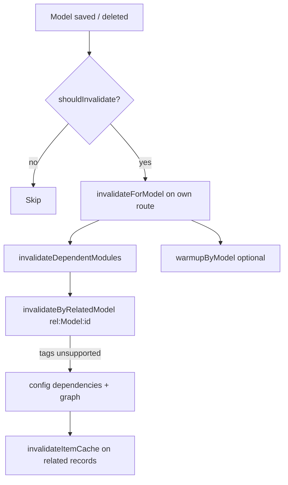

# Cache Invalidation

Invalidation keeps admin caches consistent when models change. The primary entry point is `CacheObserver`, registered automatically when an entity uses `HasCaching`.

## Observer Events

| Eloquent event | Invalidated caches | Warmup default |
|----------------|-------------------|----------------|
| `created` | Counts, index, dependent routes | `warmup: false` |
| `updated` | Record, counts, index, formattedItem, formItem, dependents | `warmup: true` (re-warm item) |
| `deleted` | Same as updated | `warmup: true` |
| `restored` | Same as updated | `warmup: true` |
| `forceDeleted` | Full route invalidation | `warmup: true` |



## CacheObserver

**Location:** `src/Entities/Observers/CacheObserver.php`

### `shouldInvalidate(Model $model)`

Returns `false` when:

- Global cache is disabled or Redis is unreachable
- Model calls `shouldCacheInvalidate()` and returns false (via `withoutCacheInvalidation()`)

Returns `true` when the model's own route has caching **or** any configured/graph dependents exist — so dependent-only invalidation still runs even if the source module has cache disabled.

### Own-route invalidation

When caching is enabled for the model's module route, `ModularousCache::invalidateForModel()`:

- With **tags enabled:** flushes the route tag set (`{prefix}:{Module}:{Route}`)
- Without tags: selectively invalidates counts, index, formattedItem, formItem by pattern

On **update**, the observer clones and refreshes the model before invalidation so stale attribute state does not skip necessary flushes.

### Dependent modules

`invalidateDependentModules()` runs after every qualifying event:

1. **Granular (preferred):** `invalidateByRelatedModel(class, id)` flushes only entries tagged `rel:{ModelBasename}:{id}`
2. **Fallback:** When tags are unavailable, resolves dependents and calls `invalidateItemCache` on related records via configured relationships

Loop prevention: a static `$invalidating` map keyed by `class:id` prevents infinite observer chains.

## Relationship Graph

Auto-discovery scans module entities with `getEloquentRelationships()` and builds a directed graph of which routes display which related models.

| Graph support | Relationship kinds |
|---------------|-------------------|
| Direct | HasMany, BelongsTo, HasOne, MorphMany, MorphTo |
| Through | BelongsToMany (pivot tables), HasOneThrough, HasManyThrough |

**Commands:**

```bash
php artisan modularous:cache:graph show
php artisan modularous:cache:graph rebuild
php artisan modularous:cache:graph stats
php artisan modularous:cache:graph analyze --model=Post
```

Config: `modularous.cache.graph.enabled` and `graph.ttl` (default 24h).

`RelationshipGraph::getAffectedModuleRoutes($modelClass)` and `getAffectedModuleRoutesByTable($tableName)` feed `CacheObserver::getCacheDependents()`.

## Manual `dependencies` Config

Explicit entries in `config('modularous.cache.dependencies')` merge with graph and model-level overrides.

**Key:** Full model class name, e.g. `Modules\PressRelease\Entities\PressRelease`.

**Value:** Array of dependency descriptors:

| Field | Purpose |
|-------|---------|
| `moduleName` | Target module (StudlyCase) |
| `moduleRouteName` | Target route / entity basename |
| `types` | Which cache types to invalidate (`counts`, `index`, `record`, `formattedItem`, `formItem`) |
| `targetRelationshipName` | Relationship on the **saved** model pointing to target records |
| `isSelf` | When true, invalidate the same id on the target route's model class |
| `selfModelClass` | Override source class for relationship lookup |
| `shouldWarm` | When `false`, skip post-invalidation warmup for this dependent (default `true`). Combined with the source model's `shouldWarmDependentModules()` — warmup runs only when both allow it |

### b2press-app example

When `PressRelease` is saved, invalidate payment sub-routes:

```php
'Modules\PressRelease\Entities\PressRelease' => [
    [
        'moduleName' => 'PressRelease',
        'moduleRouteName' => 'PressReleasePayment',
        'types' => ['counts' => false, 'index' => false, 'record' => true, 'formattedItem' => true, 'formItem' => true],
        'targetRelationshipName' => 'pressReleasePayments',
    ],
    [
        'moduleName' => 'SystemPayment',
        'moduleRouteName' => 'Payment',
        'types' => [ /* … */ ],
        'targetRelationshipName' => 'payments',
    ],
],
```

When `Payment` is saved with `isSelf: true`, the observer finds the matching `PressReleasePayment` record by the same primary key.

## Relation Tags

When repository or controller code stores cache via `putWithRelations`, foreign keys from each row are registered as tags:

```
{prefix}:rel:{ModelBasename}:{id}
```

On `Company:5` update, only caches that referenced `company_id = 5` are flushed — not every route in the application.

**Requires:** `use_tags: true` and a tag-capable driver (Redis recommended).

`CacheableTrait::extractRelationIds` and `CacheableResponse::extractModelRelationIds` walk `*_id` attributes and resolve Eloquent relationship classes.

## Model-Level Overrides

Entities can declare dependents without config:

```php
// Method override
public function getCacheDependents(): array
{
    return [
        ['moduleName' => 'Blog', 'moduleRouteName' => 'Post', 'types' => ['formattedItem' => true]],
    ];
}

// Or property
public array $cacheDependents = [ /* same shape */ ];
```

## Conditional Invalidation on Models

```php
// HasCaching trait
$model->withoutCacheInvalidation()->update([...]); // skip observer flush
$model->preventDependentWarming();                 // skip warmupByModel on dependents
```

Per-dependent warmup can also be disabled in config:

```php
[
    'moduleName' => 'PrimaryPage',
    'moduleRouteName' => 'CountryPackagesHub',
    'types' => ['presentationItem' => true],
    'shouldWarm' => false,
],
```

## Post-Invalidation Warmup

`invalidateForModel` calls `warmupByModel($model)` after update/delete when `warmup` option is true (default). This repopulates `counts`, `formattedItem`, and `formItem` for the saved record so the next admin request is a cache hit.

Created records pass `warmup: false` to avoid warming before the admin navigates to the new item.

## See Also

- [Warmup](./warmup) — `warmupByModel` and artisan warm
- [Configuration](./configuration) — `dependencies` schema
- [cache:graph](../console/cache/cache-graph) — graph management commands
