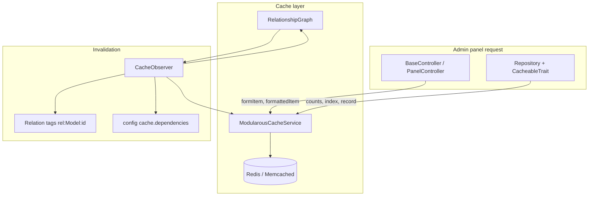

# Module Route Cache Overview

Module-route cache stores **admin panel** query and transformation results in Redis (by default), keyed by module name, route name, cache type, and a hash of request parameters. Writes flow through repositories and controllers; invalidation is driven by Eloquent observers and a cross-module relationship graph.

## Architecture



## Request Flow

```mermaid
sequenceDiagram
    participant C as Controller
    participant R as Repository
    participant M as ModularousCache
    participant DB as Database

    C->>R: getPaginator() / getByIdCached()
    R->>M: shouldUseCache(type)?
    alt cache enabled + hit
        M-->>R: cached payload
        R-->>C: result
    else miss
        R->>DB: query
        DB-->>R: models
        R->>M: remember / putWithRelations
        R-->>C: result
    end

    Note over C,M: formattedItem / formItem skip repository;<br/>controller calls rememberCache directly
```

## Cache Key Format

Keys are built by `ModularousCacheService::generateCacheKey()`:

```
{prefix}:{ModuleName}:{RouteName}:{type}:{params_hash}
```

| Segment | Example | Source |
|---------|---------|--------|
| `prefix` | `modularous` | `config('modularous.cache.prefix')` |
| `ModuleName` | `PressRelease` | StudlyCase module name |
| `RouteName` | `PressReleasePayment` | StudlyCase route / entity basename |
| `type` | `counts`, `index`, `formattedItem:42` | Cache type (+ optional record id in specifier) |
| `params_hash` | `a1b2c3…` | `md5(serialize(normalizedParams))` or `default` |

**User-aware caching:** When `user_aware` is true and the repository uses scopes like `CreatorTrait` or `AssignmentTrait`, `_user` is added to params before hashing:

```
{prefix}:{module}:{route}:{type}:{hash_with_user_context}
```

**Relation tags** (for granular invalidation) use a separate tag namespace:

```
{prefix}:rel:{ModelBasename}:{id}
```

Example: `modularous:rel:Company:5` — flushed when `Company` id `5` is updated.

## Trait and Class Map

| Artifact | Location | Role |
|----------|----------|------|
| `ModularousCacheService` | `src/Services/ModularousCacheService.php` | Driver connection, `remember`, tags, TTL resolution, stats |
| `Cacheable` | `src/Traits/Cache/Cacheable.php` | `shouldUseCache`, `rememberCache`, module/route name resolution |
| `CacheKeyGenerators` | `src/Traits/Cache/CacheKeyGenerators.php` | Type-specific specifier keys (`count:all`, `formattedItem:42`) |
| `HasUserAwareCache` | `src/Traits/Cache/HasUserAwareCache.php` | Per-user cache keys when repository traits add user scopes |
| `CacheableTrait` | `src/Repositories/Logic/CacheableTrait.php` | Repository caching: counts, index, record, relation tagging |
| `CacheableResponse` | `src/Http/Controllers/Traits/CacheableResponse.php` | Controller caching: `formItem`, relation extraction |
| `WarmupCache` | `src/Traits/Cache/WarmupCache.php` | Post-invalidation and artisan warm helpers |
| `HasCaching` | `src/Entities/Traits/Core/HasCaching.php` | Registers `CacheObserver` on the model |
| `CacheObserver` | `src/Entities/Observers/CacheObserver.php` | Invalidates on create/update/delete/restore/forceDelete |

## Layer Responsibilities

| Layer | What is cached | Typical producer |
|-------|----------------|------------------|
| **Repository** | `counts`, `index`, `record` | `CountBuilders`, `QueryBuilder::getPaginator`, `getByIdCached` |
| **Controller** | `formItem`, `formattedItem` | `FormPageUtility::getFormItem`, `TableItem::getFormattedIndexItem` |
| **Config** | TTL, per-route type toggles | `config/merges/cache.php` + app `cache.modules` |
| **Observer** | Invalidation only | `CacheObserver` on models with `HasCaching` |

## Graceful Degradation

`ModularousCacheService` pings Redis on boot. If the connection fails, `isEnabled()` returns `false` for all operations — queries run against the database with no exception thrown. This keeps admin usable when cache infrastructure is down.

## See Also

- [Configuration](./configuration) — enable flags and TTL hierarchy
- [Cache Types](./cache-types) — per-type behavior and producers
- [Invalidation](./invalidation) — observer events and dependency graph
