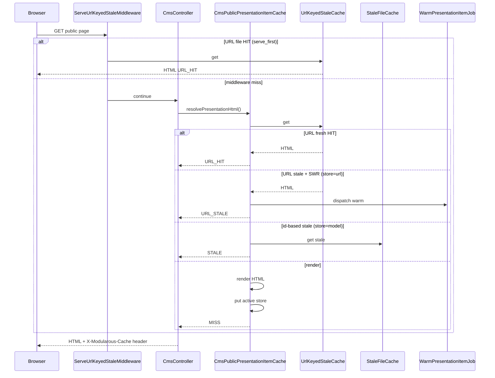

# Stale-While-Revalidate (SWR)

SWR keeps public `presentationItem` pages fast when the **fresh TTL expires**. The active store is chosen by `MODULAROUS_PRESENTATION_CACHE_STORE` (`url`, `model`, or `none`).

Full env table and layer resolution: [Configuration — Presentation item cache](./configuration#public-presentationitem-cache).

## Storage model

| Store | Driver | Purpose |
|-------|--------|---------|
| `url` (default) | `UrlKeyedStaleCache` | Locale + normalized path; optional middleware `serve_first` |
| `model` | `StaleFileCache` (id-keyed) | Legacy id/locale keyed files under `modularous-stale` — **requires `store=model`** |
| `none` | — | Always render; no presentation cache |

When `presentationItem.swr` is true **and** the route has `types.presentationItem=true`, the active store serves HTML past fresh TTL until `stale_expires_at` (controller path). Background warm jobs are dispatched with cooldown `MODULAROUS_RESOURCE_CACHE_SWR_WARM_COOLDOWN`.

### `store=model` vs `store=url` (important)

These are **mutually exclusive** store strategies, not layered fallbacks:

| Aspect | `store=url` | `store=model` |
|--------|-------------|---------------|
| File layout | `modularous-stale-by-url/{locale}/{hash}.html` | `modularous-stale/{Module}/{Route}/{Model}/{id}/{locale}/…` |
| Key | Locale + path (+ optional query) | Module + route + model id + locale |
| Writes on miss | Always (when route enabled) | **Only when `swr=true`** |
| `serve_first` middleware | Available | Not used |
| Redis required for reads | No (`isCacheTypeConfigured`) | Yes (`isEnabled`) |
| SWR status header | `URL_STALE` | `STALE` |

The deprecated `cache.swr.*` config aliases still resolve for tests, but new deployments should set `MODULAROUS_PRESENTATION_CACHE_STORE` and `MODULAROUS_PRESENTATION_CACHE_SWR` directly.

URL files:

```
storage/framework/cache/modularous-stale-by-url/{locale}/{sha256(path)}.html
```

Model store:

```
storage/framework/cache/modularous-stale/{Module}/{Route}/{Model}/{id}/{locale}/{paramsHash}.html
```

Public `presentationItem` does **not** use Redis for HTML storage.

## Configuration

```php
'presentationItem' => [
    'store' => env('MODULAROUS_PRESENTATION_CACHE_STORE', 'url'), // url | model | none
    'swr' => env('MODULAROUS_PRESENTATION_CACHE_SWR', false),
    'serve_first' => env('MODULAROUS_PRESENTATION_CACHE_SERVE_FIRST', true),
    'stale_ttl' => (int) env('MODULAROUS_PRESENTATION_CACHE_STALE_TTL', 604800),
    'warm_dispatch_cooldown' => (int) env('MODULAROUS_RESOURCE_CACHE_SWR_WARM_COOLDOWN', 600),
    'model' => ['stale_path' => env('MODULAROUS_RESOURCE_CACHE_SWR_STALE_PATH', storage_path('framework/cache/modularous-stale'))],
    'url' => [
        'driver' => env('MODULAROUS_PRESENTATION_CACHE_URL_DRIVER', 'file'),
        'base_path' => env('MODULAROUS_CACHE_URL_STALE_PATH', storage_path('framework/cache/modularous-stale-by-url')),
    ],
],
```

| Env var | Config key | Default | Meaning |
|---------|------------|---------|---------|
| `MODULAROUS_PRESENTATION_CACHE_STORE` | `presentationItem.store` | `url` | `url` = path files; `model` = id-based stale (legacy SWR path) |
| `MODULAROUS_PRESENTATION_CACHE_SWR` | `presentationItem.swr` | `false` | Enable stale window + background warm in controller |
| `MODULAROUS_PRESENTATION_CACHE_STALE_TTL` | `presentationItem.stale_ttl` | `604800` | `stale_expires_at` — hard file expiry from write time |
| `MODULAROUS_RESOURCE_CACHE_TTL_PRESENTATION_ITEM` | `ttl.presentationItem` | `900` | Fresh TTL → `expires_at` in URL `.meta` |
| `MODULAROUS_RESOURCE_CACHE_SWR_WARM_COOLDOWN` | `presentationItem.warm_dispatch_cooldown` | `600` | Lock TTL before re-dispatching `WarmPresentationItemJob` |
| `MODULAROUS_RESOURCE_CACHE_SWR_STALE_PATH` | `presentationItem.model.stale_path` | `storage/framework/cache/modularous-stale` | Model store directory (`store=model` only) |

**Legacy:** `MODULAROUS_RESOURCE_CACHE_SWR_ENABLED` → `presentationItem.swr` when `MODULAROUS_PRESENTATION_CACHE_SWR` is unset. `MODULAROUS_RESOURCE_CACHE_SWR_STALE_TTL` → `stale_ttl`.

SWR applies per route only when `types.presentationItem` is enabled in module cache config.

### SWR off vs on (by store)

| Store | `swr=false` | `swr=true` |
|-------|-------------|------------|
| `url` | Controller re-renders after fresh TTL (`MISS`). `serve_first` middleware may still return `URL_STALE` until `stale_expires_at`. | Controller returns `URL_STALE` + queues warm. |
| `model` | No stale files written; always render. | Serves id-keyed stale file (`STALE`) + queues warm. |
| `none` | No effect | No effect |

## Request flow



### Response header

Public CMS responses include:

```
X-Modularous-Cache: presentationItem=URL_HIT|URL_STALE|STALE|MISS|BYPASS|DISABLED
```

| Status | When |
|--------|------|
| `URL_HIT` | URL file served, `now <= expires_at` |
| `URL_STALE` | URL file served past fresh TTL (middleware always; controller when `swr=true`) |
| `STALE` | Id-based `StaleFileCache` hit (`store=model`, `swr=true`) |
| `MISS` | Rendered live; file written if store allows |
| `BYPASS` | Explicit SWR bypass (e.g. preview) |
| `DISABLED` | `store=none` or route/global cache off |

Use this header in monitoring to distinguish URL disk hits from id-based stale serves.

### Resilience

`ServeUrlKeyedStaleMiddleware` can serve URL-keyed HTML **before** the controller (no DB/Redis). See [URL Stale Resilience](./url-stale-resilience).

Render failures are **not** masked — exceptions from Blade rendering still propagate.

## Invalidation

| Action | URL stale files | Id-based stale | Redis admin types |
|--------|-----------------|----------------|-------------------|
| Model save / relation tag flush | Deleted via `UrlRoute` paths | Deleted via `forgetByRelation` | Flushed via tags |
| Explicit per-record purge | Deleted | Deleted | Flushed |
| Fresh TTL expiry | Serves as URL_STALE until `stale_expires_at` | Serves as STALE (fallback) | N/A for public HTML |

## Revalidate webhook

External systems (CDN, deploy hooks) can queue purge/warm via HMAC-signed POST:

```
POST /api/modularous/cache/revalidate
X-Modularous-Signature: sha256=<hmac of raw body>
```

```json
{
  "module": "PrimaryPage",
  "route": "Home",
  "id": 42,
  "action": "purge",
  "types": ["presentationItem"]
}
```

| Field | Required | Values |
|-------|----------|--------|
| `module` | yes | StudlyCase module name |
| `route` | yes | StudlyCase route name |
| `id` | no | Record id (omit for route-wide) |
| `action` | yes | `purge`, `warm`, `both` |
| `types` | no | Defaults to `presentationItem` only |

Webhook config:

```php
'webhook' => [
    'enabled' => env('MODULAROUS_RESOURCE_CACHE_WEBHOOK_ENABLED', false),
    'secret' => env('MODULAROUS_RESOURCE_CACHE_WEBHOOK_SECRET'),
],
```

Disabled by default. Returns `404` when disabled; `401` on signature mismatch.

## Related

- [Configuration — Presentation item cache](./configuration#public-presentationitem-cache) — env vars, layer stack, toggle matrix
- [CMS public pages](./cms-public-pages) — `presentationItem` overview
- [URL Stale Resilience](./url-stale-resilience) — file-primary URL cache (`store=url`)
- [Invalidation](./invalidation) — tag and graph invalidation
- [Warmup](./warmup) — `WarmPresentationItemJob` background refresh
