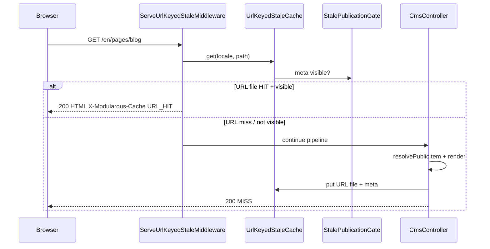

# URL-Keyed Stale Resilience

Public CMS pages use a **file-primary** presentation cache keyed by **locale + normalized URL path** when `MODULAROUS_PRESENTATION_CACHE_STORE=url` (default). On a cache HIT, HTML is served from disk without touching Redis or the database.

Admin cache types (`record`, `index`, `formItem`, `formattedItem`) remain on Redis.

## Storage layout

```
storage/framework/cache/modularous-stale-by-url/
  {locale}/
    {sha256(cache_lookup_key)}.html
    {sha256(cache_lookup_key)}.meta
```

`cache_lookup_key` is the normalized path, or `path?sorted_query` when query-aware caching is enabled for that route.

Each `.meta` file stores publication snapshot fields used at serve time:

- `published`, `publish_start_date`, `publish_end_date`
- `visibility_profile`: `singular` (day bounds, `IsSingular`) or `standard` (datetime, `HasScopes`)
- `module`, `route`, `urlable_type`, `urlable_id`
- `normalized_path`, `normalized_query`, `cache_lookup_key`
- `expires_at` (fresh TTL) and `stale_expires_at` (SWR window)

## Query-parameter cache variants

Dynamic public pages (blog search, paginated listings) can vary by allowlisted query params.

Per module route:

```php
'BlogLanding' => [
    'presentation_cache_key' => 'path_and_query_allowlist',
    'presentation_cache_query' => ['page', 'searchblogtext'],
    'types' => ['presentationItem' => true],
],
```

Strategies:

| Key | Behavior |
|-----|----------|
| `path_only` (default) | Cache key is path only; query params are ignored |
| `path_and_query_allowlist` | Only allowlisted params participate in the key; unknown params bypass cache |
| `path_and_query` | All query params are sorted into the key |

For `serve_first` middleware (before route match), map paths in `presentationItem.url.path_query`:

```php
'path_query' => [
    '/blog' => ['page', 'searchblogtext'],
    '/blog/search' => ['page', 'searchblogtext'],
],
```

Warmup writes the default view (no query params). Other combinations are cached on first request after a miss.

`POST` requests are never served from URL cache; blog search POST redirects to a GET results URL.

## Request flow



`ServeUrlKeyedStaleMiddleware` runs **before route matching** (global HTTP middleware when `serve_first` is enabled) and is skipped on artisan/queue (`Modularous::isNonHttpConsoleContext()`) and on panel URLs (`! Modularous::isFrontUrl()`). Public front is `APP_URL`; the panel is `ADMIN_APP_URL` (subdomain) or `APP_URL` + `ADMIN_APP_PATH` (path prefix). Path exclusions (`/system`, `/api`, …) still apply on the front host.

## Configuration

Full env table and layer resolution: [Configuration — Presentation item cache](./configuration#public-presentationitem-cache).

```php
'presentationItem' => [
    'store' => env('MODULAROUS_PRESENTATION_CACHE_STORE', 'url'),
    'serve_first' => env('MODULAROUS_PRESENTATION_CACHE_SERVE_FIRST', true),
    'swr' => env('MODULAROUS_PRESENTATION_CACHE_SWR', false),
    'stale_ttl' => (int) env('MODULAROUS_PRESENTATION_CACHE_STALE_TTL', 604800),
    'warm_dispatch_cooldown' => (int) env('MODULAROUS_RESOURCE_CACHE_SWR_WARM_COOLDOWN', 600),
    'url' => [
        'driver' => env('MODULAROUS_PRESENTATION_CACHE_URL_DRIVER', 'file'),
        'base_path' => env(
            'MODULAROUS_CACHE_URL_STALE_PATH',
            storage_path('framework/cache/modularous-stale-by-url'),
        ),
    ],
],
```

| Env var | Config key | Default | Meaning |
|---------|------------|---------|---------|
| `MODULAROUS_PRESENTATION_CACHE_STORE` | `presentationItem.store` | `url` | Must be `url` for this feature |
| `MODULAROUS_PRESENTATION_CACHE_SERVE_FIRST` | `presentationItem.serve_first` | `true` | Middleware serves disk HTML before controller |
| `MODULAROUS_PRESENTATION_CACHE_SWR` | `presentationItem.swr` | `false` | Controller serves stale + warm; middleware ignores this flag |
| `MODULAROUS_PRESENTATION_CACHE_STALE_TTL` | `presentationItem.stale_ttl` | `604800` (7 days) | `stale_expires_at` in `.meta` (absolute from write time) |
| `MODULAROUS_CACHE_URL_STALE_PATH` | `presentationItem.url.base_path` | `storage/framework/cache/modularous-stale-by-url` | Base directory |
| `MODULAROUS_PRESENTATION_CACHE_URL_DRIVER` | `presentationItem.url.driver` | `file` | `file`, `shared_file` (EFS/NFS); future: `redis`, `s3` |
| `MODULAROUS_RESOURCE_CACHE_TTL_PRESENTATION_ITEM` | `ttl.presentationItem` | `900` | Fresh TTL → `expires_at` in `.meta` |
| `MODULAROUS_RESOURCE_CACHE_SWR_WARM_COOLDOWN` | `presentationItem.warm_dispatch_cooldown` | `600` | Dedup window for `WarmPresentationItemJob` when SWR is on |

**Legacy aliases** (when new vars unset): `MODULAROUS_CACHE_URL_STALE_ENABLED` → `store=url`; `MODULAROUS_CACHE_URL_STALE_SERVE_FIRST` → `serve_first`; `MODULAROUS_CACHE_URL_STALE_TTL` → `stale_ttl`; `MODULAROUS_RESOURCE_CACHE_SWR_STALE_TTL` → `stale_ttl`.

Enable `presentationItem` per pilot route — URL resilience only applies where that type is configured in `config/modularous.php`.

## Redis presentationItem

Public `presentationItem` no longer reads or writes Redis. Fresh HTML lives in the URL file (`expires_at` in meta). Id-based `StaleFileCache` is the **`store=model`** path (legacy SWR), not a URL-store fallback — set `MODULAROUS_PRESENTATION_CACHE_STORE=model` explicitly to use it.

## Invalidation

On model purge/unpublish/path change, `CacheInvalidation` forgets URL stale files for all `UrlRoute` rows tied to the record (locale + `normalized_path`).

## Multi-node scaling

Production currently assumes a **single app node** where local disk is sufficient. The URL presentation cache is accessed through {@see UrlPresentationCacheStoreInterface} — middleware, invalidation, and warmup call the interface, not the concrete filesystem class directly.

### Extension point

| Piece | Location |
|-------|----------|
| Contract | `src/Contracts/Cache/UrlPresentationCacheStoreInterface.php` |
| Default driver | `src/Services/Cache/FileUrlPresentationCacheDriver.php` → wraps `UrlKeyedStaleCache` |
| Driver resolution | `ModularousCacheService::resolveUrlPresentationCacheStore()` |
| Container binding | `UrlPresentationCacheStoreInterface::class` (singleton via `modularous.cache`) |
| Config | `modularous.cache.presentationItem.url.driver` |

```php
'presentationItem' => [
    'url' => [
        'driver' => env('MODULAROUS_PRESENTATION_CACHE_URL_DRIVER', 'file'),
        'base_path' => storage_path('framework/cache/modularous-stale-by-url'),
    ],
],
```

| Driver | Status | Notes |
|--------|--------|-------|
| `file` (default) | Implemented | Local filesystem at `base_path` |
| `shared_file` | Alias of `file` | Mount EFS/NFS at `base_path` across nodes — no code change |
| `redis` | Future | Optional presentationItem replay / coherence layer |
| `s3` | Future | Object storage sync; needs purge pipeline |

### Scaling paths

| Option | Notes |
|--------|-------|
| **Shared volume (EFS/NFS)** | Simplest multi-node path: set `MODULAROUS_PRESENTATION_CACHE_URL_DRIVER=shared_file` (or keep `file`) and mount `modularous-stale-by-url` on all app nodes |
| **Object storage + CDN** | Implement `UrlPresentationCacheStoreInterface` for S3; serve via CDN; wire purge through webhook or invalidation jobs |
| **Redis presentationItem replay** | Optional coherence layer when shared disk is not viable; implement driver that replays warm jobs or mirrors HTML blobs |

To add a new driver:

1. Implement `UrlPresentationCacheStoreInterface` (get/put/forget + forgetByRelation/forgetByModuleRoute/forgetPathVariants + key helpers).
2. Register in `ModularousCacheService::resolveUrlPresentationCacheStore()` for your `driver` config value.
3. Keep invalidation semantics: purge must clear **all query variants** for a locale + path.

No multi-server driver beyond `file`/`shared_file` is included in the initial rollout.

## Related

- [Configuration — Presentation item cache](./configuration#public-presentationitem-cache) — full env table and layer stack
- [CMS Public Pages](./cms-public-pages)
- [SWR](./swr) — id-based `store=model` path and warm job cooldown
- [Webhook Revalidate](./webhook-revalidate)
