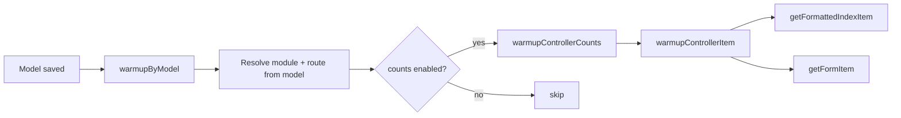

# Cache Warmup

Warmup pre-populates cache entries so the first admin request after deploy or invalidation is fast. Modularous supports **automatic warmup on model save** and **manual warmup via Artisan**.

## Automatic Warmup (`warmupByModel`)

**Location:** `src/Traits/Cache/WarmupCache.php`

Called from `ModularousCacheService::invalidateForModel()` after updates (when `warmup` option is true).

Flow:



### `warmupByModel(Model $model)`

1. Resolves `moduleName` and `moduleRouteName` from `getCacheModuleName()` / `getCacheModuleRouteName()`
2. Loads the module controller for that route
3. If `counts` is enabled → `warmupControllerCounts($controller)`
4. If `formItem` or `formattedItem` enabled → `warmupControllerItem($controller, $model, …)`

### `warmupControllerCounts($controller)`

- Skips when repository uses **user-aware cache** (counts differ per user; cannot warm globally)
- Calls `preload()`, iterates `getMainCountsList()`, runs `handleFilterCount($filter, true)` for each

### `warmupControllerItem($controller, $item, $cacheFormItem, $cacheFormattedItem)`

- `getFormattedIndexItem($item)` when `formattedItem` type is enabled
- `getFormItem($item->id, withoutDefaultScopes: true)` when `formItem` is enabled

### Bulk route warmup

| Method | Scope |
|--------|-------|
| `warmupModuleRouteCacheCounts($module, $route)` | All filter counts for one route |
| `warmupModuleRouteCacheItems($module, $route, $chunkSize)` | Every model row — form + formatted |
| `warmupModuleRouteCache($module, $route, $chunkSize)` | Counts + all items |

Default chunk size: **100** records per `each()` batch.

## Artisan Warm Commands

See [Console Commands](./console-commands) for full reference. Quick examples:

```bash
# Warm all enabled modules and routes
php artisan modularous:cache:warm

# Warm one module route
php artisan modularous:cache:warm PressRelease PressRelease

# Warm only counts
php artisan modularous:cache:warm PressRelease PressRelease --counts

# Warm only formatted table rows
php artisan modularous:cache:warm PressRelease PressRelease --formattedItems

# Warm form payloads with a record limit
php artisan modularous:cache:warm Blog Post --formItems --limit=50

# Eager-load relations while warming
php artisan modularous:cache:warm Blog Post --items --eager=author,category
```

**Signature:** `modularous:cache:warm {module?} {routeName?} {--logChannel=} {--counts} {--items} {--formItems} {--formattedItems} {--eager=} {--limit=}`

## Recommended Workflows

### After deploy

```bash
php artisan modularous:cache:graph rebuild
php artisan modularous:cache:warm
php artisan modularous:cache:stats
```

### After bulk import

```bash
php artisan modularous:cache:clear ModuleName RouteName
php artisan modularous:cache:warm ModuleName RouteName --counts --formattedItems
```

### Cron (production)

Schedule route-level warm for high-traffic admin modules during low-traffic windows. Pair with TTL settings so warm runs complement rather than replace natural cache population.

```php
Schedule::command('modularous:cache:warm PressRelease PressRelease --counts')
    ->everyFifteenMinutes()
    ->withoutOverlapping();
```

## Skipping Warmup

| Scenario | How |
|----------|-----|
| Model save should not re-warm | `invalidateForModel($model, $types, options: ['warmup' => false])` — used on `created` |
| Dependent warm on save | `$model->preventDependentWarming()` before save |
| User-scoped counts | Automatic skip in `warmupControllerCounts` when `shouldUseUserAwareCache()` |

## See Also

- [Invalidation](./invalidation) — when automatic warmup fires
- [cache:warm](../console/cache/cache-warm) — command options reference
- [Per-Module Setup](./per-module-setup) — enable types before warming
