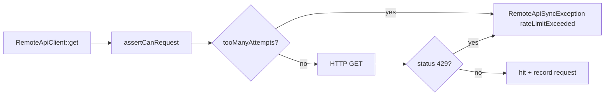

# Caching & Rate Limiting

Remote API uses two complementary mechanisms: **response caching** (reduce redundant HTTP) and **outgoing rate limiting** (protect remote API and local sync jobs).

## Response Caching

Implementation: `RemoteApiCache` + `RemoteApiConfiguration` cache settings.

### Enable / TTL

```php
// Connector remoteApiConfiguration()
'cache' => [
    'enabled' => true,
    'ttl' => 3600,  // seconds; falls back to modularous.remote_api.cache_ttl
    'tag' => 'remote-api.module_name.entity_name',
],
```

When `cache.enabled` is false, all `remember*` methods call through without storing.

### Sync vs Preview

| Call site | Cache behavior |
|-----------|----------------|
| `syncRecord` / `syncAll` | `forceRefresh=true` — bypass cache **read**, write-through (single) or `clearCache()` after batch |
| `previewRemote` / `listCatalog` / hydrate | Default cached reads within TTL |

`remember($key, $callback, $forceRefresh = false)` and `rememberPaginatedCatalog(..., $forceRefresh = false)` skip hits when forced, then persist the fresh result.

### Cache Keys

Prefixed keys isolate module, route, and invalidation generation:

```
remote-api:{module_snake}:{route_snake}:{version}:{logical_key}
```

Logical keys used by `AbstractRemoteApiConnector`:

| Logical key | Content |
|-------------|---------|
| `list:v2:{md5(query)}` | Full paginated sync list |
| `record:{remoteId}` | Single show response |
| `catalog:v2:default:{md5(query)}` | Default catalog (combobox) |
| `catalog:v2:{catalogKey}:{md5(query)}` | Named catalog endpoint |

Query hash uses sorted keys (`RemoteApiCache::queryHash`) so parameter order does not change cache keys.

### Cross-Cache Warming (List ↔ Default Catalog)

Scheduled `syncAll` calls `fetchList()`, which caches under `list:v2:*`. Form hydrate calls `listCatalog(null)`, which caches under `catalog:v2:default:*` — different logical keys.

To avoid redundant HTTP on hydrate after sync:

1. **`fetchList()`** warms the default catalog cache by transforming list rows through `afterFetch()` with catalog query (`_skip_sync_includes`).
2. **`listCatalog(null)`** falls back to a valid `list:v2:*` cache entry before calling the remote API.

Named catalogs (`catalog:v2:{catalogKey}:*`) use separate endpoints and are not warmed from the sync list.

### Tag-Based Invalidation

When the cache store supports tags (`Cache::getStore()->tags()`):

```php
Cache::tags(['remote-api.module_name.entity_name'])->flush();
```

Tag defaults to `remote-api.{module_snake}.{route_snake}` unless overridden in config.

### Version-Based Invalidation

When tags are **not** supported (file/database drivers without tags):

```php
Cache::put('remote-api:{module}:{route}:cache-version', time(), …);
```

`flush(null)` bumps this version; new keys use the updated suffix so old entries are orphaned.

### Paginated Catalog Validation

`rememberPaginatedCatalog()` stores:

```php
['expected_total' => int, 'items' => array]
```

On read, cached entries are **accepted only when**:

```php
$expectedTotal > 0 && count($items) === $expectedTotal
```

Legacy flat-list cache entries (items array only) are discarded and refetched. This prevents serving truncated lists after pagination fixes or partial API failures.

Empty item arrays are not cached (transient failures retry on next request).

### `rememberNonEmpty`

Used where an empty result should not be cached (allows retry after transient errors). Standard `remember` caches all successful callback results including empty arrays where applicable.

### Per-Record Flush

```php
$connector->clearCache(42);
// forgets record:42 and preview:42
```

Full flush from admin: **Clear Remote Cache** table action (`clear_cache` → `clearRemoteCache`) → `clearRemoteApiCache()` without id. That invalidates **all** logical keys for the connector, including named catalogs (`catalog:v2:{catalogKey}:*`).

## Outgoing Rate Limiting

Implementation: `RemoteApiRateLimiter` (used by `RemoteApiClient` before every GET).

### Configuration

Primary: `config('modularous.remote_api.rate_limiting')`

Fallback: `config('modularous.api.rate_limiting')` (same `per_minute` / `per_hour` defaults)

```php
'rate_limiting' => [
    'enabled' => true,
    'per_minute' => 60,
    'per_hour' => 1000,
],
```

Set `MODULAROUS_REMOTE_API_RATE_LIMITING_ENABLED=false` to disable outgoing checks (not recommended in production sync jobs).

### Key Normalization

Limiter keys group by host + path template (numeric id segments stripped):

```
remote-api-outgoing:api.example.com:/api/v1/entities:minute
remote-api-outgoing:api.example.com:/api/v1/entities:hour
```

Separate endpoints get separate buckets.

### Enforcement Flow



1. **`assertCanRequest($url)`** — Before HTTP; throws if minute or hour bucket exceeded.
2. **`hit($url)`** — After dispatching request (counts toward limits).
3. **Remote 429** — `RemoteApiClient` throws `RemoteApiSyncException::rateLimitExceeded` with `Retry-After` header value.

### ValidationException in Admin

`ManageRemoteApiSync` converts sync exceptions to:

```php
ValidationException::withMessages(['remote_api' => [$message]]);
```

Rate limit messages include window, limit, and retry seconds — same path for outgoing limiter and remote 429 responses.

### Relation to Incoming API Limits

`modularous.api.rate_limiting` also configures **incoming** Modularous API middleware (`blocking_time`, `blocking_maximum_attempts`, etc.). Those blocking settings do **not** apply to the outgoing Remote API client — only `enabled`, `per_minute`, and `per_hour` are shared.

## Operational Tips

| Scenario | Recommendation |
|----------|----------------|
| Large catalog, slow remote API | Increase `cache.ttl`; use `catalog_http.query.per_page` |
| Sync job hits minute cap | Prefer list-page sync (`http.query.per_page` 50–100); raise `MODULAROUS_REMOTE_API_RATE_LIMITING_PER_MINUTE` if still needed |
| Stale preview after remote change | Sync already force-refreshes; or run **Clear Remote Cache** |
| Memory pressure on large lists | `syncAll` streams via `eachListPage` — keep `per_page` reasonable (50–100) |
| Paginated list incomplete | Fix `response.meta_path` / `list_path`; client throws `incompletePaginatedList` |
| Redis available | Prefer tagged cache store for clean full flush |

## HTTP Request Stats

Each connector tracks requests during a sync batch:

```php
$result['http_requests'];
// ['total' => 3, 'by_url' => ['https://api…/entities?page=1' => 1, …]]
```

Returned in `syncRemoteAll` JSON `meta.http_requests` for observability.

## Request Logging

Implementation: `RemoteApiLogger` (used by `RemoteApiClient` and `RemoteApiCache`).

### Configuration

`config('modularous.remote_api.logging')` (merged from `config/merges/remote_api.php`):

```php
'logging' => [
    'enabled' => env('MODULAROUS_REMOTE_API_LOGGING_ENABLED', true),
    'channel' => env('MODULAROUS_REMOTE_API_LOGGING_CHANNEL', 'modularous-remote-api'),
    'log_slow_requests_ms' => (int) env('MODULAROUS_REMOTE_API_LOG_SLOW_MS', 2000),
    'log_cache' => env('MODULAROUS_REMOTE_API_LOG_CACHE', true),
],
```

Modularous registers `logging.channels.modularous-remote-api` (daily file: `storage/logs/modularous-remote-api.log`).

### HTTP Log Levels

| Condition | Level |
|-----------|-------|
| Successful GET | `info` (short message: method, path, status, duration) |
| Status 429 | `warning` (includes `retry_after`) |
| Status 4xx (other) | `warning` |
| Status 5xx / transport errors | `error` |
| Duration ≥ `log_slow_requests_ms` | `warning` (`slow: true` in context) |

Structured context (JSON) includes: `event`, `method`, `url`, `status`, `duration_ms`, `timestamp`, `module`, `route`, `request_tracker`, `rate_limiting`.

### Cache Access Logs

When `log_cache` is true, `rememberPaginatedCatalog()` logs `remote_api.cache` events with `result: hit|miss|force_refresh` and the logical cache key.

Disable all Remote API logging: `MODULAROUS_REMOTE_API_LOGGING_ENABLED=false`.
