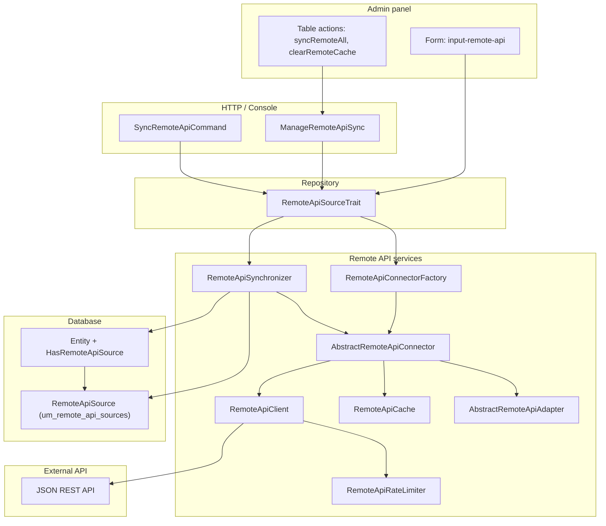

# Remote API Overview

The Remote API stack pulls records from an external JSON API and persists them locally through the **Repository** layer. Remote-only fields live on a morph **`RemoteApiSource`** row; local entity columns stay on the parent model.

## Architecture

## Layer Responsibilities

| Layer | Class / artifact | Role |
|-------|------------------|------|
| **Configuration** | `RemoteApiConfiguration`, connector `remoteApiConfiguration()` | Base URL, endpoints, field mapping, cache, actions |
| **HTTP client** | `RemoteApiClient` | GET requests, pagination, Bearer auth, 404/429 handling |
| **Outgoing limits** | `RemoteApiRateLimiter` | Per-host/per-path minute and hour caps before each request |
| **Cache** | `RemoteApiCache` | List/record/catalog caching with tag or version invalidation |
| **Connector** | `AbstractRemoteApiConnector` | Orchestrates fetch + cache + adapter hooks |
| **Adapter** | `AbstractRemoteApiAdapter` | Maps API rows to attribute arrays via `RemoteApiFieldMapper` |
| **Synchronizer** | `RemoteApiSynchronizer` | Creates/updates local records and `RemoteApiSource` rows |
| **Model** | `HasRemoteApiSource` | Virtual `remote_id` and synced fields on the entity |
| **Repository** | `RemoteApiSourceTrait` | `syncFromRemote`, `syncAllFromRemote`, previews, catalog |
| **Controller** | `ManageRemoteApiSync` | JSON endpoints and table toolbar action schema |
| **Hydrate / Vue** | `RemoteApiHydrate`, `VInputRemoteApi` | Admin combobox to pick a remote row |
| **Console** | `SyncRemoteApiCommand`, `MakeRemoteApiAdapterCommand` | CLI sync and scaffolding |

## Resolution Order

`RemoteApiConnectorResolver` picks configuration and classes in this order:

1. **Dedicated connector class** — `{Module}\RemoteApi\{Route}RemoteApiConnector` with `remoteApiConfiguration()` (preferred).
2. **Route config fallback** — `api_connector` array on the module route config when no connector class exists (`DefaultRemoteApiConnector` path).
3. **Convention-based classes** — `{Module}\RemoteApi\{Route}RemoteApi{Adapter|Dto}`; falls back to `ConfigurableRemoteApiAdapter` and `RemoteApiRecordDto`.

`RemoteApiConnectorFactory` builds a connector instance with shared `RemoteApiRateLimiter`, per-connector `RemoteApiClient`, `RemoteApiCache`, and resolved adapter.

## List-First Batch Sync

`syncAll()` uses a **list-page streaming** strategy:

1. Stream the remote paginated list page-by-page (`eachListPage` + `forceRefresh`; typically `per_page` 50–100) without loading the full payload into memory.
2. Update every **locally linked** record whose `remote_id` appears in those pages.
3. Optionally **import new** remote rows not yet linked (`sync.import_new_from_list`, default `true`).
4. Skip linked locals whose `remote_id` is missing from the remote list (stale link).
5. Clear the connector HTTP cache after the batch so preview/catalog are not left stale.

Single-record sync (`syncRecord`) always performs a fresh `GET …/{id}` (`forceRefresh`). Preview/catalog may still use TTL-cached responses.

## Virtual Attributes

`HasRemoteApiSource` exposes `remote_id` and mapped mirror fields as **virtual** model attributes for forms and API resources. They are stripped from the parent table on save and persisted on `RemoteApiSource.synced_attributes` instead. Observers hydrate virtual fields on read and persist them on save.

## Related Package Files

| Path | Purpose |
|------|---------|
| `config/merges/remote_api.php` | Global base URL, token, cache TTL, outgoing rate limits |
| `config/merges/api.php` | Incoming API rate limits (defaults mirrored by Remote API client) |
| `config/merges/tables.php` | `remote_api_sources` → `um_remote_api_sources` |
| `database/migrations/default/2026_06_21_120000_create_modularous_remote_api_sources_table.php` | Table migration |
| `src/Services/RemoteApi/` | Core service classes |
| `src/Console/stubs/remote-api/` | Generator stubs for adapter, connector, DTO |
