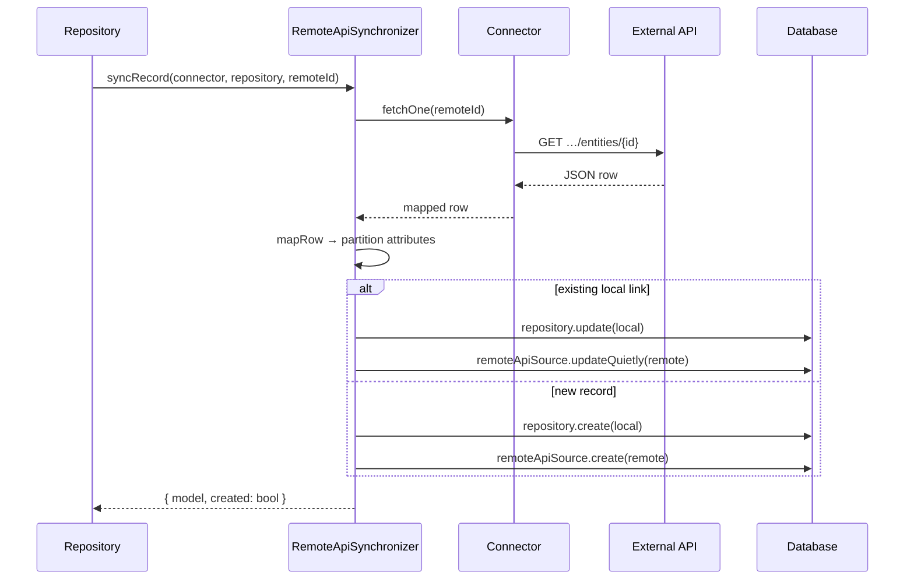

# Remote API Sync Flow

Sync always goes through the repository (`RemoteApiSourceTrait`) and `RemoteApiSynchronizer`. Controllers and console commands are thin wrappers.

## Single Record: `syncRecord`

**Entry points:**

- Repository: `syncFromRemote($localId, $remoteId)`
- Controller: `PUT …/sync-remote/{id}` with optional `remote_id` body
- Console: `php artisan modularous:sync-remote-api ModuleName entity_name --id=42` or `--local-id=7`

**Steps:**



1. **`fetchOne`** — Cached `GET` to `show_endpoint` (default `{endpoint}/{id}`).
2. **`mapRow`** — Adapter + field mapper produce flat attributes.
3. **`partition`** — Split local fillable vs remote side-table fields.
4. **Update path** — Strip virtual attrs, `repository->update`, sync `RemoteApiSource`.
5. **Create path** — `repository->create` with fallback `name` / `published` when fillable; create morph source.

Throws `RemoteApiSyncException::recordNotFound` when the remote row is missing.

## Batch: `syncAll`

**Entry points:**

- Repository: `syncAllFromRemote()`
- Controller: `POST …/sync-remote-all`
- Console: `php artisan modularous:sync-remote-api ModuleName entity_name` (no `--id`)

**Algorithm:**

1. Reset HTTP request tracker on the connector.
2. **`indexRemoteList`** — One paginated `fetchList()` pass; build `[remoteId => row]` map (uses cache).
3. **Linked locals** — For each local record with a `remote_id`:
   - If id **in** remote list → `syncRecordFromRow` (update, no extra HTTP per row).
   - If id **not in** list → skip with `not_in_remote_list` reason (stale/deleted remote).
4. **Import new** (when `sync.import_new_from_list` is true) — For each remote list id not processed in step 3 → create or update local record.
5. Return summary:

```php
[
    'created' => int,
    'updated' => int,
    'skipped' => int,
    'total' => int,
    'skipped_records' => [
        ['remote_id' => …, 'reason' => 'not_in_remote_list', 'message' => …],
    ],
    'http_requests' => ['total' => int, 'by_url' => [url => count]],
]
```

List-first batch sync minimizes HTTP: typically one paginated list request plus optional per-id fetches only when using `syncRecord`, not during `syncAll`.

## Preview (Dry Run)

Preview methods inspect local state and connector configuration **without HTTP or database writes**.

| Method | Used by | Returns |
|--------|---------|---------|
| `previewSyncFromRemote` | `--dry-run --id=` / `--local-id=` | Action (`create`/`update`), would-fetch URL, local id |
| `previewSyncAllFromRemote` | `--dry-run` (no id) | Linked records table, locals without remote id, summary counts |
| `previewRemoteCatalog` | `sync-remote-api-catalog --dry-run` | Endpoint, catalog key, available catalogs |

Console output is rendered by `InteractsWithRemoteApiSyncPreview` (configuration summary tables, `[dry-run]` labels).

Example:

```bash
php artisan modularous:sync-remote-api ModuleName entity_name --dry-run
php artisan modularous:sync-remote-api ModuleName entity_name --id=99 --dry-run
```

## Cache Clear

**Repository:** `clearRemoteApiCache($remoteId = null)`

**Controller:** `POST …/clear-remote-cache` (table toolbar action `clearRemoteCache`)

**Connector:** `clearCache($remoteId)`

| Argument | Effect |
|----------|--------|
| `null` | Flush entire connector cache tag (or bump version key) |
| Specific id | Forget `record:{id}` and `preview:{id}` keys only |

Clear cache after remote data changes outside Modularous, or when debugging stale list/record responses. Sync itself does not auto-clear cache before fetch; cached lists are reused within TTL.

## Error Handling in HTTP Layer

Controller methods catch `RemoteApiSyncException` and rethrow:

```php
ValidationException::withMessages(['remote_api' => [$exception->getMessage()]]);
```

The admin frontend surfaces this on the `remote_api` field / alert channel. Rate limit errors include retry guidance in the message.

## Manual Sync from Code

```php
// Single record by remote id
$result = $repository->syncFromRemote(null, 42);

// Single record by local id (reads linked remote_id)
$result = $repository->syncFromRemote($localId);

// Full batch
$stats = $repository->syncAllFromRemote();

// Preview only
$preview = $repository->previewSyncAllFromRemote();
```

Always use the repository — do not call `RemoteApiSynchronizer` directly from controllers.
