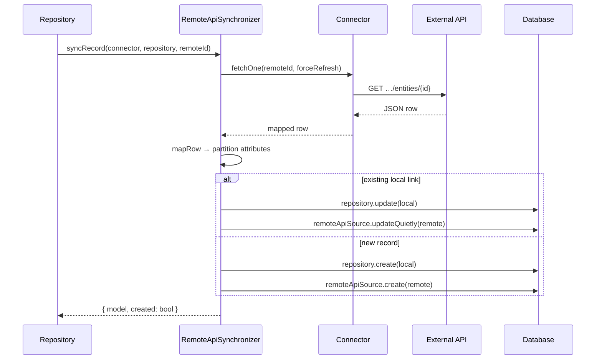

# Remote API Sync Flow

Sync always goes through the repository (`RemoteApiSourceTrait`) and `RemoteApiSynchronizer`. Controllers and console commands are thin wrappers.

## Single Record: `syncRecord`

**Entry points:**

- Repository: `syncFromRemote($localId, $remoteId)`
- Controller: `PUT …/sync-remote/{id}` with optional `remote_id` body
- Console: `php artisan modularous:sync-remote-api ModuleName entity_name --id=42` or `--local-id=7`

**Steps:**



1. **`fetchOne(..., forceRefresh: true)`** — Fresh `GET` to `show_endpoint` (default `{endpoint}/{id}`); bypasses HTTP response cache read, then write-through.
2. **`mapRow`** — Adapter + field mapper produce flat attributes.
3. **`partition`** — Split local fillable vs remote side-table fields.
4. **Update path** — Strip virtual attrs, `repository->update`, sync `RemoteApiSource`.
5. **Create path** — `repository->create` with fallback `name` / `published` when fillable; create morph source.

Throws `RemoteApiSyncException::recordNotFound` when the remote row is missing.

## Batch: `syncAll`

**Entry points:**

- Repository: `syncAllFromRemote()`
- Controller: `POST …/sync-remote-all`
- Console: `php artisan modularous:sync-remote-api ModuleName entity_name` (no `--id`)

**Algorithm:**

1. Reset HTTP request tracker on the connector.
2. Load locally linked remote IDs (DB `chunkById(100)`).
3. **`eachListPage(..., forceRefresh: true)`** — Stream the remote paginated list page-by-page (`http.query.per_page`, typically 50–100) without accumulating the full list in memory and without reading the list cache.
4. For each row on each page:
   - If remote id is **linked locally** → `syncRecordFromRow` (update).
   - Else if `sync.import_new_from_list` is true → `syncRecordFromRow` (create/update).
   - Else → ignore (linked-only mode).
5. Linked ids never seen in any page → skip with `not_in_remote_list` (stale/deleted remote).
6. **`clearCache()`** — Invalidate connector HTTP cache so subsequent preview/catalog reads are not stale.
7. Return summary:

```php
[
    'created' => int,
    'updated' => int,
    'skipped' => int,
    'total' => int,
    'skipped_records' => [
        ['remote_id' => …, 'reason' => 'not_in_remote_list', 'message' => …],
    ],
    'http_requests' => ['total' => int, 'by_url' => [url => count]],
]
```

List-page streaming minimizes HTTP and memory: a few list page requests instead of N show requests. `import_new_from_list` only controls whether unlinked remote rows are imported — sync always uses the list endpoint, never N× `fetchOne`.

## Preview (Dry Run)

Preview methods inspect local state and connector configuration **without HTTP or database writes** (except `previewRemote`, which may use cached `fetchOne`).

| Method | Used by | Returns |
|--------|---------|---------|
| `previewSyncFromRemote` | `--dry-run --id=` / `--local-id=` | Action (`create`/`update`), would-fetch URL, local id |
| `previewSyncAllFromRemote` | `--dry-run` (no id) | Linked records table, locals without remote id, summary counts |
| `previewRemoteCatalog` | `sync-remote-api-catalog --dry-run` | Endpoint, catalog key, available catalogs |

Console output is rendered by `InteractsWithRemoteApiSyncPreview` (configuration summary tables, `[dry-run]` labels).

Example:

```bash
php artisan modularous:sync-remote-api ModuleName entity_name --dry-run
php artisan modularous:sync-remote-api ModuleName entity_name --id=99 --dry-run
```

## Cache Clear

**Repository:** `clearRemoteApiCache($remoteId = null)`

**Controller:** `POST …/clear-remote-cache` (table toolbar action `clearRemoteCache`)

**Connector:** `clearCache($remoteId)`

| Argument | Effect |
|----------|--------|
| `null` | Flush entire connector cache tag (or bump version key) |
| Specific id | Forget `record:{id}` and `preview:{id}` keys only |

Sync **bypasses cache reads** via `forceRefresh`. After `syncAll`, the connector cache is cleared so list/catalog keys are not left stale. Preview and catalog may still use TTL-cached responses.

## Error Handling in HTTP Layer

Controller methods catch `RemoteApiSyncException` and rethrow:

```php
ValidationException::withMessages(['remote_api' => [$exception->getMessage()]]);
```

The admin frontend surfaces this on the `remote_api` field / alert channel. Rate limit errors include retry guidance in the message.

## Manual Sync from Code

```php
// Single record by remote id
$result = $repository->syncFromRemote(null, 42);

// Single record by local id (reads linked remote_id)
$result = $repository->syncFromRemote($localId);

// Full batch
$stats = $repository->syncAllFromRemote();

// Preview only
$preview = $repository->previewSyncAllFromRemote();
```

Always use the repository — do not call `RemoteApiSynchronizer` directly from controllers.
