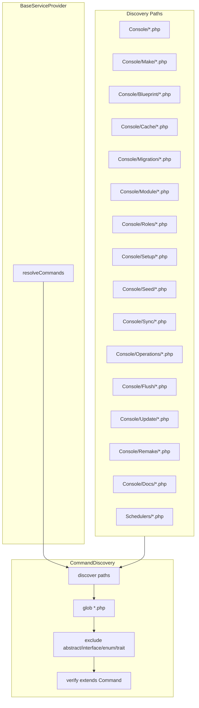

# Console Commands — Structure & Conventions

This document describes the Modularous console command architecture, naming conventions, and rules for adding or modifying commands.

## Architecture Overview



Commands are **auto-discovered** via `CommandDiscovery::discover()` in `BaseServiceProvider`. No manual registration is required. Place a command class in a scanned path and it will be registered.

## Folder Structure

| Folder | Purpose | Class Pattern |
|--------|---------|----------------|
| `Console/` (root) | Build, refresh, pint, dev, replace:regex, composer, etc. | `*Command` |
| `Console/Make/` | Artifact generators (scaffolding) | `Make*Command` |
| `Console/Blueprint/` | ModuleRoute Blueprint provider scaffolding | `MakeBlueprint*Command` |
| `Console/Cache/` | Cache operations | `Cache*Command` |
| `Console/Migration/` | Migration operations | `Migrate*Command` |
| `Console/Module/` | Route enable/disable, fix module, remove module | `*Command` |
| `Console/Roles/` | Roles load, refresh, rollback, list, super-admin | `Roles*Command` |
| `Console/Setup/` | Install, create superadmin, create database, setup development | `*Command` |
| `Console/Seed/` | Seed payment, pricing, VAT rates | `Seed*Command` |
| `Console/Sync/` | Sync translations, states | `Sync*Command` |
| `Console/Operations/` | Process, publish one-time operations | `*Command` |
| `Console/Flush/` | Flush, flush sessions, flush filepond | `Flush*Command` |
| `Console/Update/` | Update Laravel configs | `Update*Command` |
| `Console/Remake/` | Re-align existing module artifacts to a feature contract (`remake:cmr`, `remake:revisions`, …) | `Remake*Command` |
| `Console/Docs/` | Generate command docs | `Generate*Command` |
| `Schedulers/` | Scheduler commands (package root) | `*Command` |
| `Console/Coverage/` | Coverage (CoverageServiceProvider only) | `Coverage*Command` |

## Naming Rules

### Rule 1: Class Name ↔ Signature Compatibility

**Class names must reflect the command signature.** Convert signature segments to PascalCase and append `Command`.

| Signature | Class |
|-----------|-------|
| `modularous:make:module` | `MakeModuleCommand` |
| `modularous:cache:clear` | `CacheClearCommand` |
| `modularous:route:disable` | `RouteDisableCommand` |
| `modularous:create:database` | `CreateDatabaseCommand` |

### Rule 2: Semantic Namespaces

| Namespace | Meaning | Example |
|-----------|---------|---------|
| `modularous:make:*` | Scaffold/generate files | `make:module`, `make:controller` |
| `modularous:remake:*` | Re-align existing artifacts to a feature | `remake:cmr`, `remake:revisions` |
| `modularous:create:*` | Create runtime records (DB, users) | `create:superadmin`, `create:database` |
| `modularous:cache:*` | Cache operations | `cache:clear`, `cache:warm` |
| `modularous:migrate:*` | Migration operations | `migrate`, `migrate:refresh` |
| `modularous:flush:*` | Flush/clear runtime data | `flush:sessions` |
| `modularous:route:*` | Route enable/disable/inspect | `route:disable`, `route:inspect` |
| `modularous:sync:*` | Sync data | `sync:translations` |

### Rule 3: Command Suffix

All command classes MUST end with `Command` (e.g. `InstallCommand`, not `Install`).

## Adding a New Command

1. **Choose the correct folder** based on the command's purpose.
2. **Name the class** according to the signature (e.g. `modularous:my:action` → `MyActionCommand`).
3. **Extend** `BaseCommand` (or `Illuminate\Console\Command` if BaseCommand is not needed).
4. **Place the file** in the appropriate folder — discovery will pick it up automatically.
5. **Add tests** in `tests/Support/CommandDiscoveryTest.php` if it should be explicitly asserted.

## CommandDiscovery

- **Location:** `src/Support/CommandDiscovery.php`
- **Behavior:** Scans glob paths, extracts FQCN from file content, excludes abstract/interface/enum/trait, verifies class extends `Command`.
- **Paths:** Defined in `BaseServiceProvider::resolveCommands()`.

## BaseCommand

- **Location:** `src/Console/BaseCommand.php`
- **Use:** For commands that need Modularous-specific behavior (trait options, config, etc.).
- **Alternative:** Use `Illuminate\Console\Command` for simple commands.

## Stubs — generated file bodies (HARD RULE)

**Never** embed generated file body content as heredocs, nowdocs, or concatenated PHP/string templates inside Command classes.

**Always** create or reuse a stub under `src/Console/stubs/` and render it via `Nwidart\Modules\Support\Stub` (`new Stub('/path.stub', [...])->render()` or `Stub::create(...)`).

| Rule | Detail |
|------|--------|
| Stub location | `src/Console/stubs/` (BaseCommand / Make / Remake set `Stub::setBasePath` here) |
| Placeholder style | `$PLACEHOLDER$` (e.g. `$NAMESPACE$`, `$TABLE$`) matching existing Make/Remake stubs |
| Command role | Orchestrate paths, options, and placeholder values only — zero large template strings |
| Applies to | **Make** and **Remake** commands equally |

Examples: `MakeMigrationCommand` → `/migration/create.stub`; `MakeCmsControllerCommand` → `/cms-controller.stub`; `RemakeRevisionsCommand` → `/models/revision_model.stub`, `/remake/revisions-migration.stub`, `/remake/revisions-operation.stub`; `RemakeCmrCommand` → `/route-controller-front-cms.stub`.

Docs: `docs/src/pages/guide/console/make/stubs.md` (Make stubs command + note that Remake shares `src/Console/stubs/`).

## Backward Compatibility

When renaming commands, add the old signature as an **alias**:

```php
protected $aliases = [
    'modularous:old:signature',
];
```

## Cache commands

`Console/Cache/*` → signatures `modularous:cache:*` (clear, warm, graph, stats, warm-presentation, purge-presentation, …).

Presentation warm/purge rules (public URL, locale context): see `src/Services/Cache/AGENTS.md`.

Docs:
- `docs/src/pages/guide/console/cache/`
- `docs/src/pages/guide/module-route-cache/console-commands.md`

## Reference

Full command mapping: see `docs/src/pages/system-reference/console-conventions.md` (VitePress).
Guide index: `docs/src/pages/guide/console/overview.md`.
